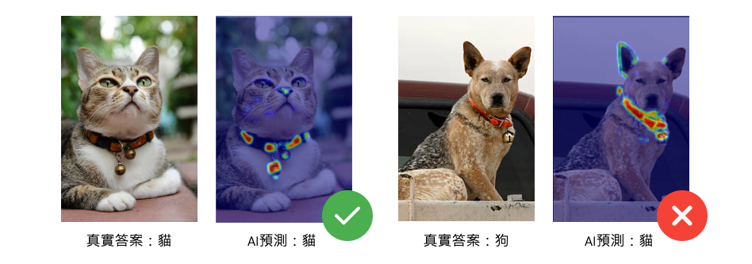
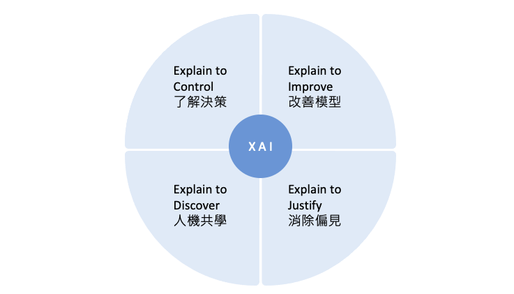

# [Day 1] 揭開模型的神秘面紗：為何XAI對機器學習如此重要？
人工智慧的發展已經進入了一個新的階段，作為AI的重要分支「機器學習」，已經被廣泛應用於各個領域，例如語音識別、圖像分類、自然語言處理......等。然而隨著機器學習技術的發展，特別是模型「黑箱」特性，使得其決策過程變得越來越不透明，且缺乏對外部人員的解釋和理解，這也使得機器學習在一些關鍵領域難以得到應用。因此這就引出了一個重要的議題：我們該如何確保機器學習模型的可解釋性？為此，可解釋人工智慧（Explainable AI，XAI）的出現成為了一個重要的研究方向。

> XAI 旨在提高機器學習模型的可解釋性，使人們能夠理解模型的工作原理，進一步提高機器學習模型的可信度和可靠性。

## 為何需要解釋模型？
在人工智慧領域中，模型解釋性已經成為一個重要的課題。過去機器學習模型被視為一個黑箱，因為它們的決策過程往往過於複雜而難以解釋。這個問題已經引起了關注，對於那些需要理解模型背後的邏輯和決策過程的人來說，黑箱模型是不可接受的。

簡單來說，揭開模型的神秘面紗可以讓人們理解機器學習模型如何進行預測和決策。這種理解對於提高機器學習模型的可靠性和可信度至關重要。

## XAI 所扮演的角色
假設我們有一個卷積神經網路（CNN）模型，用於分類圖像中的物體種類。當我們輸入一張照片給模型時，模型會給出一個預測結果，並告訴我們照片中的物體種類是什麼。但是當模型給出錯誤的預測時，我們無法了解模型為何做出這樣的決策。這時候模型解釋的技術就可以幫助我們理解模型的決策過程，例如哪些區域對預測結果有較大的影響，哪些特徵對預測結果貢獻較大等等。以下舉一個經典的影像分類案例，也就是大家所熟知的貓狗分類。曾經的我以為已經訓練了一個辨識能力極高的貓狗分類器，但是在實際驗證集資料中的準確率不到一半，這很明顯是模型[過擬合](https://ithelp.ithome.com.tw/articles/10278254)的結果。最後使用可解釋的技術對模型進行解析，發現模型並非真的學到辨識貓狗的關鍵特徵。罪魁禍首竟然是因為訓練集中有許多的貓咪照片都戴著鈴鐺項圈，導致模型誤認項圈為辨識貓狗的關鍵特徵。這個案例顯示了模型解釋的重要性，因為如果無法理解模型背後的邏輯和決策過程，那麼模型的效能可能會受到負面的影響。

上述是一個經典的影像辨識 XAI 技術的案例，從中可以發現訓練一個機器學習模型所使用的資料品質極為重要。Landing.ai 執行長吳恩達曾在某場演講中提到，透過資料的改善所帶來的最終影響遠大於改善模型本身，因為資料標註所帶來的偏差往往是影響模型訓練的關鍵因素之一。

> 延伸閱讀：[The Future of Data-Centric AI](https://medium.com/@andy6804tw/the-future-of-data-centric-ai-a36bea495d1c)

## XAI 的重要性和優點
透過 XAI 提高模型可靠性和解釋性，使機器學習成果能夠被更廣泛的人理解和接受。此外透過解釋不同的特徵對模型決策的影響，幫助資料科學家改進和優化模型。
- XAI 能夠幫助機器學習模型更好地解釋其決策過程
  - 這對於確定模型的弱點和提高其性能至關重要。透過 XAI 技術，我們可以更好地理解模型如何作出決策，從而發現其缺陷和潛在的偏見。

- XAI 能夠改善機器學習模型的可信度和可靠性。
  - 當模型的決策過程變得透明時，使用者和機器學習模型的開發者可以更好地了解模型的表現和弱點，進而提高模型的可信度和可靠性。

- XAI 能夠促進人機共學
  - 將機器學習模型設計為可解釋的，有助於人類更好地理解其決策並與其合作。這樣可以使人工智慧在更多的領域得到應用，從而為人類創造更多的價值。

- XAI 能夠使模型消除偏見
   - 可幫助確定機器學習模型中可能存在的偏見和歧視，進而調整訓練數據和模型架構，消除這些偏見。

## XAI 的應用領域
XAI 的應用領域十分廣泛，例如在智慧製造中，XAI 能夠幫助工程師對於機台異常狀況或參數最佳化進一步分析，並提高產能；在金融領域中，XAI 能夠幫助分析師對金融產品進行分析，提高金融風險管理的效率和準確性；在醫療領域中，XAI 能夠幫助醫生更好地理解疾病和治療方案，提高患者的醫療服務質量和安全性；在自動駕駛領域中，XAI 能夠幫助駕駛更好地理解自動駕駛系統的決策，提高駕駛安全性。

XAI 的出現使得機器學習技術能夠更好地應用於各個領域，提高模型的可靠性和透明度，同時也能夠提高應用場景的安全性和隱私性。總之，在這三十天當中將會逐一地介紹機器學習和深度學習領域中常見的模型解釋技巧。請各位盡請期待！

## Reference
- [XAI| 模型可解釋性的重要](https://medium.com/sherry-ai/xai-%E6%A8%A1%E5%9E%8B%E5%8F%AF%E8%A7%A3%E9%87%8B%E6%80%A7%E7%9A%84%E9%87%8D%E8%A6%81-a0bbaa649978)
- [增加內容參考](https://www.slideshare.net/dineshv62/explainable-ai-238430774)