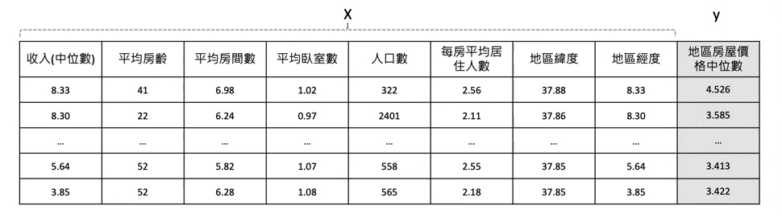

# [Day 10] Permutation Importance：從特徵重要性角度解釋整個模型行為
範例程式：[](https://colab.research.google.com/github/andy6804tw/crazyai-xai/blob/main/code/10.Permutation_Importance：從特徵重要性角度解釋整個模型行為.ipynb)


全局模型解釋是試圖理解整個模型的行為，而不僅僅是對單個預測進行解釋。Permutation importance 方法就是一種廣泛用於評估機器學習模型特徵重要性的技術之一，而且它是一種與模型無關的可解釋技術。

此模型解釋方法通常會返回每個特徵的重要性分數，分數越高則該特徵對於模型的影響性越大。因此當我們對其中一個特徵數值修改後對整體預測結果變動很大，可以推論該特徵可能是重要的。具體來說就是把一個特徵的某個值替換成另一個值之後，到底會對預測 error 有多大的影響。以預測區域房價為例，Permutation importance 算出來結果越小的話代表該特徵一點都不重要，有無它都沒關係。而計算出來越大的特徵，例如收入對於該地區的房屋價格預測是有很大的貢獻。


## 演算法流程
Permutation importance 的基本概念是將資料集中的每個特徵進行隨機重排，然後測試模型在重排後數據上的推論變化。如果某個特徵隨機排列對模型的預測產生了顯著的影響，則可以推斷該特徵對模型的重要性較高。



實際步驟如下：首先用訓練資料訓練一個模型，接著用測試資料及對每筆資料做預測並計算一個分數。R2 分數是評估一個迴歸模型有多好，所以 1-R2 代表預測結果有多不好。而 AUC 是衡量分類問題的指標越接近 1 越好，因此 1-AUC 可以視為該模型預測多麼不好，類似於 Error 的感覺。當然分類問題也可以使用準確率。接著如果我們要對特徵 x 來查看有多重要，就是隨機的對 x 特徵替換掉其他的數值最後再計算這個 Error 有多大。因此 Permutation importance 計算某特徵的重要程度公式為，搗亂之後的error/原始乾淨資料集的error，又或是兩個分數相減。

1. 訓練一個模型，可以得到一個基準的評估指標，例如準確率或 R2 等。
2. 使用測試資料集對每筆資料做預測並計算一個error分數。
    - 迴歸模型： 1-R2 
    - 分類模型：1-Accuracy
3. 隨機的對 x 特徵內的所有數值替換掉，並算出error。
4. 計算每個特徵重要性
    - 搗亂之後的error-原始乾淨資料集的error

> 重複2、3步驟直到所有特徵都執行過一遍。


## 使用 eli5 實作 Permutation Importance
[eli5](https://github.com/eli5-org/eli5) 是一個解釋機器學習模型的 Python 套件，其中提供了 Permutation Importance 的方法。它可以計算模型的特徵重要性，並將其可視化為一個長條熱圖，可以快速地比較每個特徵的重要性。首先透過 pip 安裝 eli5 套件：

```sh
pip install eli5
```

接著載入今天的範例測試集。[fetch_california_housing](https://scikit-learn.org/stable/modules/generated/sklearn.datasets.fetch_california_housing.html) 是 sklearn 中的一個內建資料集，用來預測加州地區的房屋價格中位數。這個資料集包含了 8 個特徵，分別是：

- MedInc：該區域內家庭收入的中位數
- HouseAge：該區域內房屋的平均房齡
- AveRooms：該區域內房屋的平均房間數
- AveBedrms：該區域內房屋的平均臥室數
- Population：該區域內人口數
- AveOccup：該區域內平均每個房屋的居住人數
- Latitude：該區域內房屋所在緯度
- Longitude：該區域內房屋所在經度

這個資料集包含了 20640 筆樣本，每個樣本都有上述 8 個特徵以及房屋價格中位數作為目標變數。

```py
from sklearn.datasets import fetch_california_housing
from sklearn.model_selection import train_test_split
from sklearn.ensemble import RandomForestRegressor
import numpy as np

# 載入加州地區房屋價格預測資料集
data = fetch_california_housing()
feature_names = np.array(data.feature_names)
X, y = data.data, data.target

# 切分資料集為訓練集和測試集
X_train, X_test, y_train, y_test = train_test_split(X, y, random_state=42)

# 訓練隨機森林迴歸模型
model = RandomForestRegressor(random_state=0).fit(X_train, y_train)
```

本範例訓練一個隨機森林模型，並使用了 eli5 套件中的 PermutationImportance 方法，用於計算每個特徵在模型中的重要性。程式碼中的 model 是指建立好的機器學習模型，而 X_test 和 y_test 則是測試資料集。

```py
import eli5
from eli5.sklearn import PermutationImportance

perm = PermutationImportance(model, random_state=42).fit(X_test, y_test)
eli5.show_weights(perm, feature_names = feature_names, top=8)
```

上述程式碼中使用 PermutationImportance 方法來計算每個特徵的重要性，並將結果存入 perm 變數中。在計算過程中，random_state 參數用於確保結果的再現性。接著使用 eli5.show_weights 方法將結果可視化。feature_names 參數是特徵的名稱列表，top 參數則用於指定要顯示的重要性排名前幾的特徵。這個方法將會顯示每個特徵的名稱以及其對應的重要性分數，分數越高表示該特徵對模型的影響越大。


上面的結果，可以看到最重要的特徵是該地區的收入中位數，確實挺合理的。若出現紅色負數的分數其實都可以視作幾乎不重要的變數。


## 小結
Permutation importance 的優點是可以用於任何模型演算法和任何資料集，並且可以提供關於每個特徵的直觀解釋。值得注意的是該方法忽略了特徵之間的交互作用，即特徵之間可能存在依賴關係，某些特徵在單獨考慮時看似不重要，但在與其他特徵結合後可能會產生重要的影響。因此，Permutation importance 方法不能完全代表特徵對模型的影響，而應當結合領域知識、模型內部解釋等多種方法進行綜合評估。另外它的缺點是計算量較大，特別是在資料集較大、特徵較多的時候。若想同時考慮到兩個特徵對於輸出的影響該怎辦？明天就會來跟大家介紹另一種 Model Agnostic 全局解釋的方法 Partial Dependence。

## Reference
- [具有多重共線性或相關特徵的置換重要性](https://scikit-learn.org.cn/view/254.html)
- [（機器學習）可解釋性(2) Permutation Importance](https://medium.com/@hupinwei/%E6%A9%9F%E5%99%A8%E5%AD%B8%E7%BF%92-%E5%8F%AF%E8%A7%A3%E9%87%8B%E6%80%A7-machine-learning-explainability-%E7%AC%AC%E4%BA%8C%E8%AC%9B-c090149f0772)
