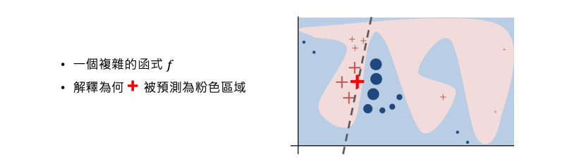
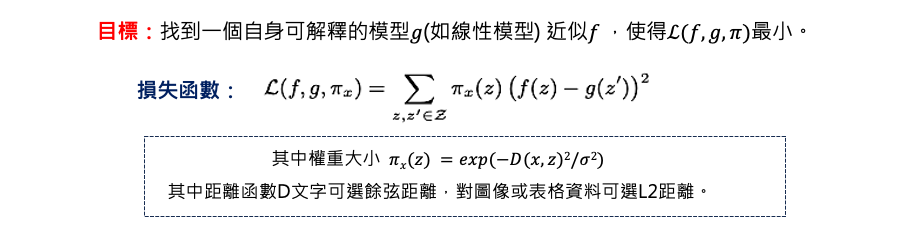
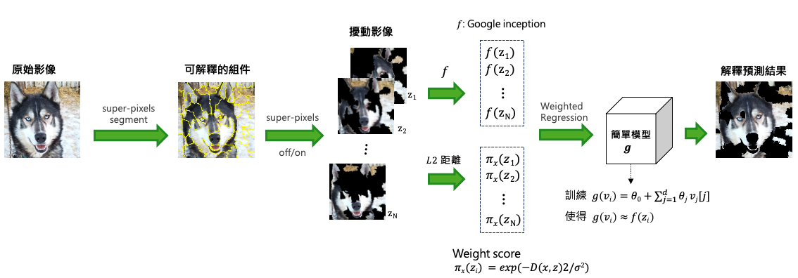

# [Day 12] LIME理論：如何用局部線性近似解釋黑箱模型

LIME 的全名是 Local Interpretable Model-agnostic Explanations ，其目的是可以分析模型對於某筆資料為何做出特定的決策，並且可以應用於神經網路、SVM、隨機森林、XGBoost 等各種模型。它可適用於表格資料(分類＆迴歸)、文字和影像，並提供對單筆資料的解釋。

- KDD2016 Conference原作者介紹LIME[影片](https://www.youtube.com/watch?v=hUnRCxnydCc)
- 原始論文：[" Why should i trust you?" Explaining the predictions of any  classifier.](https://arxiv.org/abs/1602.04938)

首先以表格資料以分類任務為例，將一筆顧客訂單丟入以訓練好的分類模型後。即可透過 LIME 分析是否可能即將流失。並且說明哪些特徵是影響客戶流失的重要因子。

第二個例子是影像分類，我們將一張圖片丟入 Google inception 模型進行預測得到前三名的結果為電吉他(32%)、古典吉他(24%)、拉布拉多(21%)。透過 LIME 可以做出為何模型會預測某種類別的原因，解釋為何分類為電吉他的證據以及其它類別像是拉布拉多的證據在哪。

最後一個例子是檔案文件分類，分辨是無神論的文章或是基督教內容的文章。這邊有兩種演算法對同一篇文章進行辨識，透過 LIME 可以分析兩種演算法對於該類預測結果的證據為何。透過用字遣詞可以確認模型是否有真的學到辨識的精髓，而不是過擬合。

## LIME 運作原理
這裡我們來談談 LIME 如何實現。假設資料有兩個特徵，粉紅與藍色是透過某種機器學習演算法圍出來的邊界。接著我們要分析為何+被預測為粉紅的類別。LIME 的做法是先從訓練資料集中隨機的採樣一些資料出來並丟入訓練好的模型(f)進行預測得到結果。預測完之後我們拿這些採樣預測後的結果與要被分析解釋的那筆資料+進行距離計算。離+資料點越近的資料重要性就越高(圖中+和o會越大)。最終會生成一個非常簡單並可解釋的模型g(例如線性模型)，其目標訓練一個簡單 g 模型使得預測結果越接近 f 所預測的結果越好(並非 ground true)。訓練一個簡單模型的前提是距離被分析的那筆資料越接近的資料要與 f 預測結果越接近越好。因此就可以透過以訓練好的線性模型對該筆資料進行解釋。

LIME的運作方式如下：
1. 生成一個新的數據集，其中包含經過排列的樣本，並使用黑盒模型預測。
2. 在新的數據集上訓練一個可解釋模型，根據抽樣實例與目標實例的接近程度加權。
3. 將新的數據集訓練一個簡單模型。

## LIME – tablular dataset
這裡以一個實際表格資料做展示，對於表格數據，LIME 的抽樣來源通常來自訓練集。假設從資料集中採樣 N 筆資料，並丟入以訓練好的模型進行預測並得到標籤。x 是一筆想被分析的測試資料，將會與剛被採樣每筆去計算距離。第三步驟訓練一個簡單易解釋的模型，如果 x 離採樣的資料很近的話我們期望要與原本 f 的模型預測結果要相近。透過該目標函式定義好後，就能訓練一個簡單的 g 模型。

## LIME – image dataset
首先透過影像處理技巧將一張影像切成 K 份 super-pixels，因此同一個區塊可能是類似的物件。接著產生N個長度為K的向量，perturbed image 的意思就是當向量中 0 就代表保留該區塊 1 去除該區塊。因此會產生 N 張不同的影像，每張影像中可能都有幾個 super-pixels 為空白。

將一張圖片透過 super-pixels 產生出 N 張不同的圖片，即代表目前手上有了 N 張與原圖相似的圖片。接著將這 N 張圖片丟入訓練好要被解釋的 Google inception 模型中，預測這 N 張圖片的類別。同時必須計算這 N 張圖片與原圖有多像，算的方式就是每個向量跟全部是 0 的向量(代表沒有抹除是完整圖)去計算歐氏距離(L2 Distance)，因此算出來越接近 1 代表與原圖越相似。最後建立一個線性迴歸模型 g 使得跟原本模型 f 預測越相近越好。最終把特別重要的 super-pixels 秀出來。

## 小結
LIME（Local Interpretable Model-Agnostic Explanations）是一種與「模型無關」的解釋方法，它可以被用於任何機器學習模型，而不受特定模型算法或架構的限制。並且適用於表格數據、文字和圖像。這使得 LIME 成為一個通用的解釋工具，可應用於不同領域和問題場景。此外 LIME 提供的解釋是基於單個實例的，這使我們能夠更深入地了解模型在個別實例上的預測和決策依據。

## Reference
- Ribeiro, Marco Tulio, Sameer Singh, and Carlos Guestrin. "[" Why should i trust you?" Explaining the predictions of any  classifier.](https://arxiv.org/abs/1602.04938)" Proceedings of the 22nd ACM SIGKDD international conference on knowledge discovery and data mining. 2016.
- [使用 LIME 解釋複雜的分類模型](https://taweihuang.hpd.io/2018/02/27/introtolime/)
- [LIME可解釋性分析-ImageNet圖像分類](https://blog.csdn.net/m0_59286668/article/details/128426336)
- [Unboxing the black box using LIME](https://towardsdatascience.com/unboxing-the-black-box-using-lime-5c9756366faf)