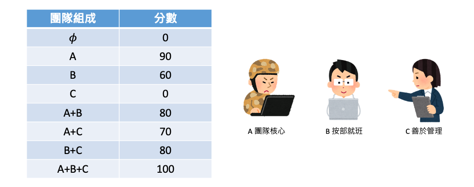
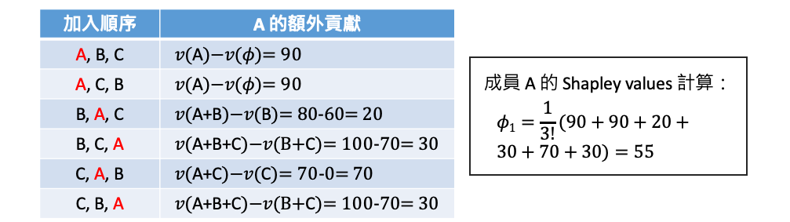
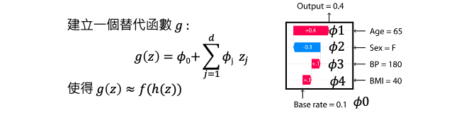
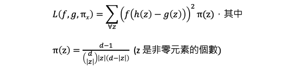

# [Day 14] SHAP理論：解析SHAP解釋方法的核心

## Shapley values 簡介
Shapley values 最早是由經濟學家 Lloyd Shapley 所提出，用於評估參與合作博弈的每個玩家對於勝利的貢獻價值。在機器學習中，我們可以將這個概念應用到輸入特徵 X 對於輸出的影響上，透過 Shapley values 可以計算每個特徵對於輸出的貢獻。簡單來說，Shapley values 計算的是在各種情況下，如果某個特徵被加入到模型中，它會帶來多少額外的貢獻。最後我們將所有特徵的額外貢獻的期望值加總，就得到了所謂的 Shapley values。透過這種方法可以幫助我們理解模型中每個特徵對於輸出的影響程度，進而提高模型的可解釋性和可信度。

## 簡單例子解釋 Shapley values
假設團隊有三個人共同接了一個案子，根據每個人的貢獻程度將酬勞按比例分配。透過計算 Shapley values，我們能夠評估每個成員在完成任務時的貢獻大小，以實現更公平的酬勞分配。以下是三個成員的性格特質及在互相合作和獨立作業時所能達成的貢獻分數。其分數範圍在0到100之間，代表他們參與完成案子的能力與效率。

- A(工程師) 喜歡獨立作業，能力強，是團隊中的核心人物。
- B(工程師) 謹慎按部就班，能確保任務進行順利且無差錯。
- C(專案經理) 無產出能力，但擅於溝通並管理整個團隊的工作。

從下表中可以依據三位在團隊中加入的順序進行排列組合，其中 𝜙 代表團隊都沒有人的情況下產出當然為 0，接著可以得知 A、B、C 三人獨立工作的分數分別為 90, 60, 0。至於合作的部分 A+B 共同工作的產出為 80，從這組合當中可以發現 B 的加入使得共同產出下降了 10(A就是典型的單打獨鬥，有人插手反而拖累進度)。其餘的 A+C 和 B+C 的工作產出分別為 70 和 80。最後 A+B+C 三人各自發揮專長，且有了 C 的溝同協調才使得工作順利完成使分數得到滿分 100。

有了上表產出分數後，我們就可以去計算每個人在團隊的貢獻值。其計算方式根據所有組隊成員加入的所有順序，再去計算在各種順序下每個人額外的貢獻個是多少。首先計算 A 的貢獻程度，三個人總共有六種加入的組合順序，如下表所示：

- 首先第一個加入順序為 A,B,C， A 所扮演的角色為第一個因此是 90。
- 第二個組合 A,C,B 跟第一個案例一樣由於 A 加入時還是空的因此還是由 A 自己出力貢獻為 90。
- 若 B,A,C 的順序由 B 先做然後 A 再加入，此時 A 有加入或沒加入的差別就是 A 和 B 一起組隊，或是 B 自己。因此 A 在這一組合中所帶來額外的貢獻為 (A+B)-B=20。
- 若 B,C,A 的話 A 所帶來的額外貢獻為，(A+B+C)-(B+C)=30
- 若 C,A,B 的話 A 所帶來的額外貢獻為，(A+C)-(C)=70
- 若 C,B,A 的話 A 所帶來的額外貢獻為，(A+B+C)-(B+C)=30

到目前為止已經計算完在所有的加入組合順序中 A 所帶來的額外貢獻，因此 A 的 Shapley values 就是將所有的組合的貢獻分數做一個平均得到 55。

上面步驟依此類推在六種組隊可能的順序中為每個人分別計算帶來的額外貢獻分數，平均就可以得到在這一個任務中每個人的貢獻程度了。最後我們可以分別計算出 A、B 和 C 的 Shapley values，如下表所示，最後得到 A 為 55， B 為 40，C 為 5，可以發現這三個值相加其實就等於 100。

## SHAP (SHapley Additive exPlanations)
以上述的例子每個人就等同於機器學習中的 X 特徵，而 y 就是輸出。我們要觀察每個特徵 X 對於計算 y 的貢獻程度有多少，因此我們必須去計算所有特徵的 Shapley values 各是多少。但是當 X 的特徵數量太多的時候，假設有 d 個特徵的時候我們就相當於要計算 2的d次方-1種可能性，這也意味著要個別訓練這麼多模型。假設有兩個特徵，則要計算 Shapley values 就必須訓練三個模型：

- 第一個模型：f(x1)
- 第二個模型：f(x2)
- 第三個模型：f(x1, x2)

若特徵數量太多的時候訓練大量的模型代價是很高的，因此可以透過 SHAP (SHapley Additive exPlanations) 來計算特徵的重要性，進而解釋模型的預測結果，而不需要訓練大量的模型。本篇的主角 SHAP 是一種解釋性技術，它就是使用 Shapley values 的概念來評估每個特徵對於模型預測的貢獻。SHAP 提供了以下幾種 kernel 來快速估計 Shapley values：

- TreeExplainer
- DeepExplainer
- GradientExplainer
- LinearExplainer
- KernelExplainer 

每一個 kernel 的簡單介紹可以參考本系列[[Day 4] LIME vs. SHAP：哪種XAI解釋方法更適合你？]()，而在今日的文章中我們將重點放在通用的 KernelExplainer，它主要透過生成新的擾動資料來近似計算 SHAP，且適用於各種不同類型的模型。

## 解析 KernelExplainer 背後原理
以下解釋採用 kernel shap 的方式來估計 Shapley values。假設第 i 筆資料 d 個特徵長像下面這樣子。我們要另外建立一個長度為 d 的 z 向量，這裡的 z 就好比每個特徵是否要被考慮因此不是1(出現)就是0(忽略)。

h(z) 就是將一組特徵透過 z 來決定要觀察哪些特徵，假設 x=[1,2,3,4]、z=[1,0,1,0] 就是要保留第一跟第三個特徵。因此 h(z)=[1, 隨機, 3, 隨機]，所謂的忽略就是隨機的從訓練資料集中取一筆資料出來將第二和四個特徵放入取代隨機。因此 xk 就是隨機從訓練資料集抽取的一筆資料。

所以 h(z) 其實就是一個 one-to-many 的映射，由於會隨機的抽取資料取代0位置的數值。如果我們用這種方式產生很多組 z 的話會產生 2 的d次方的可能性。

還記得我們在 Day4 解釋 SHAP 運作原理的例子嗎？假設有輸入四個特徵，年齡、性別、血壓、BMI作為輸入要預測一個人罹癌的機率。𝜙0 就是基準點 base rate 這裡為 0.1，表示每個人都有 0.1 的機率罹癌。𝜙1～𝜙4 代表四個特徵對罹癌的貢獻值，全部相加起來就是那個人離癌的幾率了。因此 SHAP 就是要訓練一個模型 g() 要學習每個 𝜙。

- g(z): 為被簡化的可解釋的模型
- z: 表示每個特徵是否要被考慮，1(出現)、0(忽略)
- d: 輸入特徵的個數
- 𝜙0: 代表基準值
- 𝜙j: 代表每個特徵的Shapley values

g() 是 SHAP 自行定義的模型，其目標是希望 g(z) 能夠接近於 f(h(z))。換句話說，如果對於第 i 筆資料樣本 x=[1,2,3,4] 以及 z=[1,0,1,0]，只觀察第一和第三個特徵時，f(h(z)) 的預測結果將會趨近於 g(z) 也就是 𝜙0+𝜙1+𝜙3。

請各位回想一下之前在做 LIME 的時候需要從資料抽一些樣本要與被觀察的那筆資料計算距離，越近就代表越重要。因此 kernel shape 的方法中也是要給予權重的概念，但方法不同。差別在於它的 loss function 後面多了 π(z) 也就是所謂的權重，這個權重的決定取決於 z 有多少個1。

延續剛剛的例子假設我們要觀察第一和第三個特徵時，損失函數中最後一項 π(z) 的計算方式直接套入上面式子。代表這筆資料猜對的重要程度，其中 c(4,2) 代表排列組合中的 C4 取 2。表示在有 4 個元素的集合中，選取 2 個元素的組合數量。

在 Kernel SHAP 中，對於特徵子集的抽樣是通過進行 Monto Carlo 抽樣的方式進行的。預設情況下，當特徵小於等於11個特徵時，SHAP 演算法會抽取 nsamples 數量為 `2**M - 2` 筆資料。而特徵數量大於11個時，會抽取 nsamples = `2*M + 2048` 個特徵子集作為近似計算的樣本，其中 M 是特徵的數量。會有這樣的機制是因為當特徵數量增加時，為了保持計算效率，Kernel SHAP 會進行抽樣，只包含部分特徵子集，但仍然能夠提供合理的解釋整個模型。

- 當M<=11個特徵以下： nsamples = 2**M-2
- 當M>11個以上： nsamples = 2*M + 2048

> 詳細資訊可以直接參考 Kernel SHAP 的原始[程式碼](https://github.com/shap/shap/blob/master/shap/explainers/_kernel.py#L311)。

簡單來說 SHAP 的套件實現會根據特徵數量和計算成本採取適當的抽樣策略，以提供近似的 Shapley 值計算結果。對於小特徵集，它會包含所有可能的特徵組合，對於大型特徵集，則透過抽樣方式來有效估計 Shapley 值。

> 由於 Kernel SHAP 對模型類型沒有假設，它的速度比其他特定於模型類型的算法慢例如像是 Tree SHAP。

## Reference
- Scott Lundberg, et al. "[A Unified Approach to Interpreting Model Predictions](https://arxiv.org/abs/1705.07874)." Arxiv, 2017.

- Kjersti Aas, et al. "[Explaining individual predictions when features are dependent: More accurate approximations to Shapley values](https://arxiv.org/abs/1903.10464)." Arxiv, 2019.
