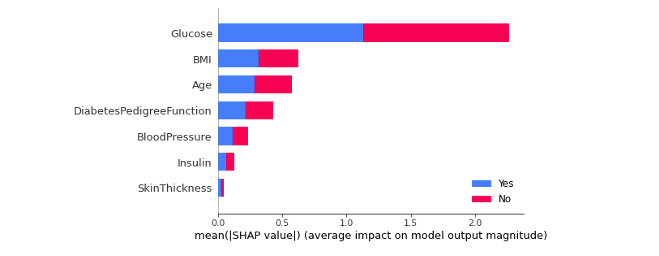
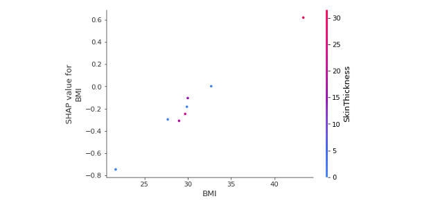

# [Day 15] SHAP實作：實戰演練SHAP解釋方法
範例程式：[]()

昨天已經瞭解了 SHAP 套件背後的核心技術。SHAP 提供多種解釋工具，可應用於不同類型的模型：

- KernelExplainer（Kernel SHAP）： 適用於任何模型，它結合了 LIME 和 Shapley values 方法，透過估計 SHAP 值來提供解釋。
- TreeExplainer（Tree SHAP）： 適用於 tree-based 與 ensemble 系列模型，包括 XGBoost、LightGBM、CatBoost、scikit-learn 和 pyspark 樹相關的模型，透過 Tree SHAP 算法計算 SHAP 值。
- DeepExplainer（Deep SHAP）： 基於 SHAP 和 DeepLIFT 算法，專門用於計算深度學習模型的 SHAP 值，幫助解釋深度學習模型的預測。
- GradientExplainer： 基於 SHAP 和 Integrated Gradients 算法，用於近似計算深度學習模型的 SHAP 值，其速度會比 DeepExplainer 慢。
- LinearExplainer： 用於解釋線性模型的預測，適用於具有獨立特徵的線性模型。

## SHAP 的優缺點
Shapley values 為我們提供了特徵在實例上的邊際貢獻。它適用於分類和迴歸任務，且可用於表格數據、文字和圖像。以下為各位統整 SHAP 的優缺點：

- SHAP 的優點：
	- 穩固的理論基礎： SHAP 繼承了博弈理論中 Shapley values 的理論基礎。
	- 效率提升： SHAP 確保模型預測值和平均預測值之間的差異在特徵之間公平分配，保證解釋的效率和合理性。
	- 通用性： SHAP 是一種通用的解釋工具，能夠應用於多種機器學習演算法和模型類型，不受模型選擇的限制。
	- 提供全局和局部解釋： SHAP 不僅能夠提供單一實例的解釋，還能夠計算全局的特徵重要性。

- SHAP 的缺點：
	- 計算時間與特徵數量成正比：當特徵的數量增多時，計算 SHAP 值所需的時間也會隨之增加。
	- 解釋複雜性：在解釋複雜模型時，SHAP 值可能無法完全捕捉模型的複雜內部關係，導致解釋的不完全性。
	- 數據分佈敏感： SHAP 值的計算可能對數據分佈敏感，不同的數據分佈可能導致不同的解釋結果。


## [實作] SHAP 解釋分類模型
本日範例一樣以一個糖尿病預測資料集訓練一個 SVM 分類器。接這透過 Kernel SHAP 對模型進行解釋。首先我們先載入今天範例的資料集，該資料集可以從 Kaggle 資料科學平台[取得](https://www.kaggle.com/datasets/mathchi/diabetes-data-set)。

### 載入資料集
```py
import pandas as pd

# 讀取資料集
df_train = pd.read_csv('./diabetes.csv')
```

讓我們來瞧瞧 df_train 裡面的內容。我們可以發現該資料集有總共有 768 筆數據，每一筆資料有八個欄位資訊，其中包含模型的輸入與輸出。


這個資料集來自美國國家糖尿病和消化和腎臟疾病研究所。其目標是根據診斷測量來預測病人是否患有糖尿病。資料集的變數如下：

- Glucose：口服葡萄糖耐量測試中2小時的血漿葡萄糖濃度，用於測試糖尿病的診斷。
- BloodPressure：舒張壓(mm Hg)，血壓中的一個參數，用於衡量心臟在收縮時的壓力。
- SkinThickness：三頭肌皮膚褶皺厚度(mm)，用於衡量皮膚的脂肪層厚度。
- Insulin：2小時血清胰島素(mu U/ml)，用於評估胰島素水平，對糖尿病的診斷非常重要。
- BMI：身體質量指數，表示體重和身高的比例，用於評估體重狀況。
- DiabetesPedigreeFunction：糖尿病家族遺傳函數，用於衡量患有糖尿病的家族遺傳風險。
- Age：病人的年齡。
- Outcome：病人是否患有糖尿病(作為模型輸出)，值為0表示沒有糖尿病，值為1表示患有糖尿病。

### 切割資料集
接下來從剛剛讀取進來的 df_train 資料集中，將所有的輸入特徵資料提取出來，作為模型的輸入 X。同時，我們從 df_train 中取得 `Outcome` 欄位的資料，作為模型的輸出 y，用來表示病人是否患有糖尿病。除此之外，我們也將所有輸入特徵的欄位名稱儲存到 `x_feature_names` 變數中，`y_label_names` 則是儲存輸出的標籤名稱，這兩個個變數將在後續 SHAP 模型解釋的過程中使用。最後透過 `train_test_split` 方法切割訓練集與測試集。

```py
from sklearn.model_selection import train_test_split

x_feature_names = df_train.drop(['Outcome'], axis=1).columns
y_label_names = ['No', 'Yes']
X = df_train.drop(['Outcome'], axis=1).values # 移除y並取得剩下欄位資料
y = df_train['Outcome'].values # 取得病人糖尿病結果作為y

X_train, X_test, y_train, y_test = train_test_split(X, y, test_size=0.01, random_state=42, stratify=y)
```

### 訓練模型 (SVM 分類器)
我們將使用 SVM 建立一個分類模型，並使用訓練資料（X_train, y_train）進行訓練。由於 SHAP 解釋分類器需要模型預測每個類別的機率，因此在訓練 SVM 分類器時，需要添加參數 `probability=True`，以確保模型在推論時能夠輸出預測機率。

```py
from sklearn import svm

# 建立 kernel='linear' 模型
model=svm.SVC(kernel='linear', C=1, probability=True)
# 使用訓練資料訓練模型
model.fit(X_train, y_train)
```

### SHAP 解釋模型
接著我們要使用 SHAP 套件來進行模型的解釋。首先大家可以在終端機輸入以下指令安裝 SHAP 套件：

```
pip install shap
```

首先載入 SHAP 函式庫並初始化 JavaScript 環境，以便在 Jupyter Notebook 環境中能夠顯示 SHAP 的解釋圖表和視覺化結果。

```py
import shap

shap.initjs()
```

首先建立一個通用的 KernelExplainer 解釋器，並嘗試剖析剛剛所訓練的 SVM 分類模型。以下是常用的設定參數與說明：

Parameters:
- model：待解釋的模型。支援 sklearn 所封裝的模型，迴歸器可以使用 `model.predict`，分類器可以使用 `model.predict_proba`。
- data：可採樣的資料集，用於產生隨機擾動抽樣的子集，此資料用於訓練 SHAP 解釋模型。
- link：將SHAP簡單模型的預測輸出轉換為實際預測值的函數，提供兩種設定分別為 `identity` 和 `logit`。預設為 identity。

以下程式將已經訓練好的模型引入，並透過呼叫 predict_proba 方法來計算預測機率。在 data 參數的部分我們從訓練集中取出前 50 筆資料，用以代表整體特徵值的分布。在 SHAP 中的 KernelExplainer 方法中，link 參數用於指定預測模型的連結函數（link function）。連結函數是將線性模型的輸出轉換為實際的預測值的函數。在不同的情況下，使用不同的連結函數可以更好地適應模型的性質。此範例是分類模型，因此可以選擇 `logit`，即表示每個計算出來的 Shapley values 再通過 sigmoid 函數即代表預測機率。

```py
# 使用 Kernel SHAP 解釋模型
explainer = shap.KernelExplainer(model=model.predict_proba, data=X_train[:50], link='logit')
```

> KernelExplainer API 官方文檔可以從這裡[參考](https://shap-lrjball.readthedocs.io/en/latest/generated/shap.KernelExplainer.html)。

接著我們要使用 shap_values() 方法來估計 Shapley values 並對單筆資料進行解釋。以下是常用的設定參數與說明：

Parameters:
- X: 欲被解釋的資料。
- nsamples: 用於構建解釋每個預測的代理模型的樣本數量。

我們把之前先切割出來的測試集作為要被解釋的目標 Ｘ。接著設定 nsamples 為 100，這意味著我們將進行 100 次蒙地卡羅抽樣，從 KernelExplainer 設定的 data 中隨機擾動抽樣並建立一個 SHAP 簡單可解釋模型。對於每個隨機採樣的樣本，我們需要進行隨機擾動並進行模型推論（獲取 f() 的預測 y）。因此總共需要進行 `100*50` 次模型推論，以生成這 100 筆資料。然而 SHAP 官方建議盡量 data 的數量不要超過 100 筆數據，以避免過高的計算成本。原始碼可以從這裡[參考](https://github.com/shap/shap/blob/1ccbf672399d3467e4e4433894ed00e4f067e258/shap/explainers/_kernel.py#L104)。

```py
shap_values = explainer.shap_values(X=X_test, nsamples=100)
```

### 1. 全局解釋模型
### 1.1 SHAP Summary Plot
SHAP Summary Plot 可以幫助了解模型的特徵重要性，幫助解釋模型的預測。如果某個特徵的 SHAP 值較大且穩定，則可以認為該特徵對模型預測的影響較大且較一致。反之，如果特徵的 SHAP 值較小且不穩定，則可能認為該特徵對模型預測的影響較小或不一致。

- 點的顏色: Feature value 的大小，越紅越大、越藍越小
- X 軸: 該點對於 shap value 的影響，也就是對預測值的影響
- Y 軸: 每個特徵

我們可以使用 `plot_type` 參數設置 `bar` 畫一張條形圖，不同顏色代表不同類別(以下範例藍色代表預測Yes的重要程度，紅色為No)，每個條形代表一個特徵，並顯示該特徵對模型預測的影響程度。在這個圖表中，每個特徵對於各個類別的影響被堆疊起來，以創建整體的特徵重要性圖。

```py
shap.summary_plot(shap_values, X_test, plot_type="bar", class_names= y_label_names, feature_names = x_feature_names)
```



我們也可以觀察特定類別的 summary_plot。假設我想看模型對於預測 Yes 的重要程度，可以使用 `shap_values[1]` 的資料取得每筆測試集的 Shapley values 進行全局的解釋。以下圖來說我們可以得知模型在判斷是否罹患糖尿病情況下大多會看葡萄糖濃度(Glucose)，當數值越大越有機會罹患糖尿病。第二個重要的特徵為BMI，同樣也是當BMI越大越有機會罹患糖尿病。

```py
shap.summary_plot(shap_values[1], X_test, feature_names=x_feature_names)
```


### 1.2 SHAP Dependence Plot
SHAP 相依圖是一種散點圖，顯示了單一特徵對模型所做預測的影響。在這個例子中，當每位葡萄糖濃度越高相對應的 Shapley values 逐漸增加。

- 每個點代表資料集中的一筆預測資料
- X 軸：該特徵的實際值
- Y 軸：該特徵的 SHAP 值，表示知道該特徵的值有多大程度上改變了該樣本預測的模型輸出。

```py
shap.dependence_plot('Glucose', shap_values[1], X_test, feature_names=x_feature_names)
```


SHAP 相依圖類似於部分相依圖，但考慮了特徵之間的交互作用，我們也可以觀察兩個變數的交互作用影響，可以在 `interaction_index` 參數中設定第二個特徵名稱，顏色對應到第二個特徵數值高低的影響。以下範例觀察BMI與皮脂厚度交互作用下對於 BMI 的 SHAP 值影響。

```py
shap.dependence_plot('BMI', shap_values[1], X_test, feature_names=x_feature_names, interaction_index= 'SkinThickness')
```



### 2. 局部解釋模型
### 2.1 SHAP Force plot
我們可以觀察單一筆資料在模型中的預測情況。在 SHAP 套件中，「Force Plot」方法提供了針對單一模型預測的解釋性呈現。在這個圖表中，我們可以清楚地看到各特徵對模型對特定輸入值的預測所做的貢獻。這種方法在進行錯誤分析或深入理解特定情況下的資料時非常有幫助。

從以下圖表我們可以觀察：
1. 模型在測試集中的第一筆資料預測NO的機率有0.11，Yes的機率有0.89
2. base value: 代表模型在不看任何特徵狀況下預測的數值，在這個例子中，基準值 = 0.379。註：此基準值是有經過 sigmoid 函數。
3. 每個特徵後面的數字是該筆資料的特徵值，例如 Age 49 歲。
4. 紅色代表該特徵會增加判斷Yes的機率。而藍色代表該特徵會降低罹患糖尿病的機率。
5. 箭頭的寬度表示該特徵對輸出的影響越大。
6. Glucose、DiabetesPedigreeFunction、Age 這三個特徵明顯是判斷罹患糖尿病的重要因子。

```py
# 觀察測試集中第一筆資料預測為Yes的重要程度
index=0
print(f'測試集第 {index+1} 筆模型預測結果: {model.predict_proba(X_test[[index], :])[0]}')
shap.force_plot(explainer.expected_value[1], shap_values[1][index], X_test[index], feature_names=x_feature_names, link='logit')
```


### 2.2 SHAP waterfall plot
瀑布圖能夠以視覺方式呈現單一預測的解釋結果。因此在前面的結果基礎上，我們對測試集中的第一筆資料進行了單一預測解釋。瀑布圖的起點是模型輸出的基準值，接著每一條紀錄了每個特徵對於輸出模型預測值的正向（紅色）或負向（藍色）影響。累加起來最後再通過 Sigmoid 函數就是否罹患糖尿病的機率值了。

```py
index=0
shap.waterfall_plot(shap.Explanation(values=shap_values[1][index], 
                                    base_values=explainer.expected_value[1], data=X_test[index],  
                                    feature_names=x_feature_names))
```

從以下圖表我們可以觀察：
1. f(x) 是模型預測的對數勝算(log odds)：2.408。
2. E[f(x)] 是基準值 = 0.492。
3. 左側是特徵名稱旁邊的灰色數值是代表該筆資料的輸入值。
4. 在箭頭上的數值代表每個特徵的Shapley values貢獻值𝜙。
5. 由於選擇 "logit" 連結函數，因此x軸的單位是log odds。
6. 正值意代表該人罹患糖尿病的概率大於 0.5。
7. 負值意代表該人罹患糖尿病的概率小於 0.5。


將線性模型的輸出通過一個稱為 S 形曲線（sigmoid 函數）的轉換，將線性模型的輸出映射到0和1之間，這樣預測結果就變成了二元類別。因此我們可以理解最後的輸出就相當於，模型根據輸入的特徵判斷結果是Yes的機率有多高。


## [補充] link 參數設定時機
在 SHAP 的 KernelExplainer 方法中，參數 link 可以選擇 `identity` 或 `logit` 作為 link function(連結函數)。以下是這兩種連結函數的區別以及它們的適用時機：

**"identity" 連結函數：**
使用 identity 連結函數意味著模型的輸出直接被當作預測值，不進行額外的轉換。這在迴歸任務中較為常見，當你希望預測值與特徵之間的關係是線性的時候，可以選擇這個連結函數。

**"logit" 連結函數：**
使用 logit 連結函數則將線性輸出轉換為對數比值（log odds），這在二元分類問題中比較常見。對數比值表示某個事件發生的對數機率與不發生的對數機率之比。"logit" 連結函數適用於那些希望模型預測機率時，同時考慮到機率值的變化幅度較大的情況，例如在邏輯迴歸模型中。

選擇連結函數時，我們應該考慮模型的任務類型以及預測值和特徵之間的關係。如果你的模型是迴歸模型，並且你認為預測值與特徵之間的關係是線性的，那麼使用 "identity" 連結函數可能更適合。如果你的模型是分類模型，並且你希望考慮機率的變化，那麼 "logit" 連結函數可能更合適。

## Reference
- [shap.KernelExplainer](https://snyk.io/advisor/python/shap/functions/shap.KernelExplainer)
- [GitGub/shap](https://github.com/shap/shap)
- [Pros and Cons of CheatSheet-XAI](https://github.com/goodrahstar/cheatsheet-xai/blob/master/explainable_methods.jpg)
- [Tensorflow-預訓練ResNet50可解釋性分析](https://blog.csdn.net/m0_59286668/article/details/128426336)

- [SHAP Part 2: Kernel SHAP](https://medium.com/analytics-vidhya/shap-part-2-kernel-shap-3c11e7a971b1)
- [Explainable AI (XAI) with SHAP -Multi-Class Classification Problem](https://towardsdatascience.com/explainable-ai-xai-with-shap-multi-class-classification-problem-64dd30f97cea)