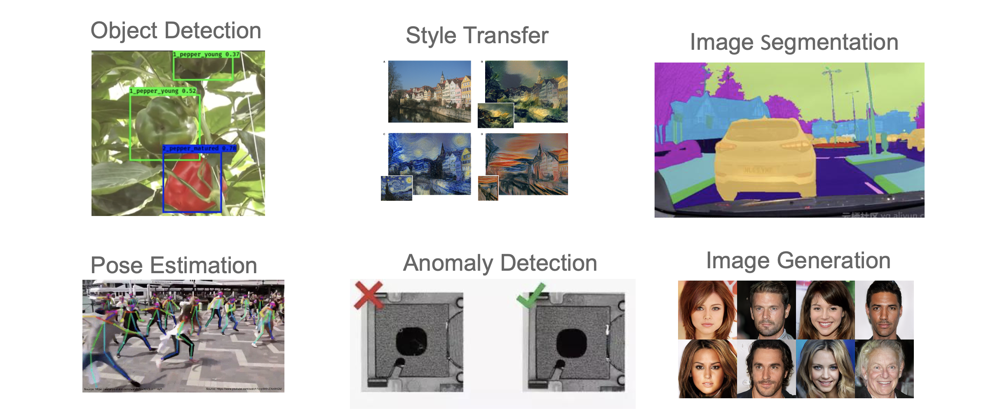
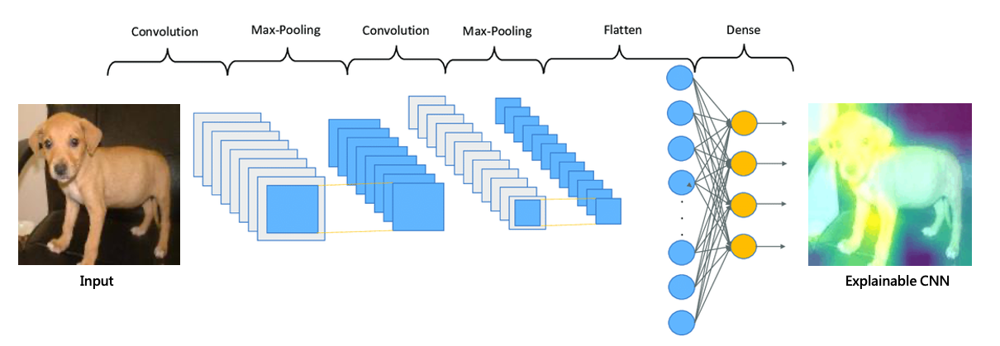

# [Day 18] CNN：卷積深度神經網路的解釋方法
在當今的深度學習領域中，卷積神經網路（CNN）已經成為許多電腦視覺任務的首選模型，例如圖像分類、物體偵測、語意分割、動作偵測等，這些重大突破都歸功於卷積神經網路的引入。然而儘管它們的強大性能，CNN 模型同樣被視為「黑盒」，難以理解其內部的決策過程。這種缺乏可解釋性可能限制了我們對模型的信任度，特別是在需要高度可解釋性和透明性的應用場景中，如醫學診斷和自動駕駛系統，這些應用更需要借助 XAI 技術來解釋模型的決策過程。

## CNN 的優點
CNN 的優勢在於其能夠在不同的層次上學習特徵。較淺的卷積層具有較小的感知域，因此它們能夠捕捉到較局部的特徵，例如影像中的細微紋理或區域性特徵。而較深的卷積層則具有更大的感知域，這使得它們能夠學習到更加抽象的特徵，例如物體的整體形狀、結構或高層次的抽象概念。這種多層次的特徵學習使得CNN能夠在處理各種視覺任務時表現出色。CNN 具有以下幾點特性：

- Local connectivity (結合影像特性)
- Weight sharing (共用學習同一組參數)
- Subsampling (池化運算)

#### 1. Local connectivity (結合影像特性)
CNN 的第一個優點在於它能夠結合影像特性，並採用區域相似性以及平滑變化的特性於模型架構中。這意味著 CNN 能夠捕捉到影像中局部區域的特徵，並將它們結合起來，以識別物體、模式或紋理等。

#### 2. Weight sharing (共用學習同一組參數)
第二個優點涉及到 CNN 的參數共享機制。在 CNN 中，同一組過濾器（filter）可以在整個影像上滑動以搜索相同的模式或特徵。這種共享權重的方式大大減少了需要訓練的參數數量，使得模型更加緊湊且計算效率更高。

#### 3. Subsampling (池化運算)
第三個優點是它使用的高效降維方法。透過 subsampling（例如池化層），CNN 可以將高解析度的影像轉換為較小的版本，同時保留了關鍵訊息。這樣的操作減少了需要訓練的神經網路參數數量，同時不會影響模型的性能。

> 我們都知道CNN具有上述幾個特點，但要如何藉由這些優點來解釋內部的運作就是Explainable CNN的課題！

## Explainable CNN
Explainable CNN（可解釋卷積神經網路）就是試圖理解 CNN 是如何做出判斷的。在圖像分類和物件辨識任務中，Explainable CNN 的目標是探索 CNN 模型對圖像的關注點是否符合人類的直覺判斷，並透過解釋性技術幫助改進模型的偏見和數據偏見，進而訓練出更優秀的模型。藉由解釋性技術，Explainable CNN 試圖找出影響模型最終判斷的關鍵部分，即模型在圖像中關注的區域或特徵。人類可以通過這些關鍵部分的樣式來解釋模型的決策，進而幫助做出更明智的決策。

假設我們訓練了一個 CNN 模型來辨識圖像中的動物，並且模型對於狗的判斷表現非常準確。我們希望了解模型是如何進行這些判斷的。透過 Explainable CNN 我們可以找到模型對於判斷狗的關鍵區域，例如耳朵、眼睛和鼻子等部位。這樣的解釋可以讓我們更好地理解模型的決策過程，並檢視模型是否真正學到了辨識狗的正確特徵。

這樣的解釋性技術有助於我們檢視模型的偏見，查看是否過度關注無關要緊的特徵或區域，以及數據的偏見，例如是否對某些類別的圖像有較大的偏好。透過理解模型的偏見以及決策方式，我們可以有針對性地調整模型的訓練過程，以獲得更公正和可靠的結果。

## Explainable CNN 技術
可解釋卷積神經網路技術提供了多種方法和技巧來解釋卷積神經網路模型的決策過程和結果。以下是幾種常見的 Explainable CNN 技術：

- Perturbation-based Explanation（擾動解釋）：
透過對輸入圖像進行微小的擾動來評估對模型預測結果的影響。它可以揭示模型對不同圖像區域的敏感性和重要性，並解釋模型的判斷過程。
- Gradient-based Explanation（梯度解釋）：計算輸入特徵對於模型輸出的梯度，來評估特徵的重要性。
- Propagation-based Explanation（傳播解釋）：基於反向傳播算法，分析模型中每個神經元對於輸出的貢獻。可以理解模型中不同神經元對於最終的決策有何影響。
- CAM-based Explanation（Class Activation Mapping 解釋）：此技術解釋模型對於不同類別的關注區域。CAM 會生成一張熱度圖，顯示模型對於特定類別的關注程度，幫助我們理解模型在圖像中關注的重要區域。
- Attention-Based Explanation（基於注意力的解釋）：這種方法關注於模型的注意力機制，即模型在處理輸入時關注哪些部分。它可以幫助我們理解模型如何對不同特徵或區域進行注意，以進行預測。

## Reference
- [Machine learning interpretability with feature attribution](https://cgarbin.github.io/machine-learning-interpretability-feature-attribution/#feature-attributions-are-approximations)