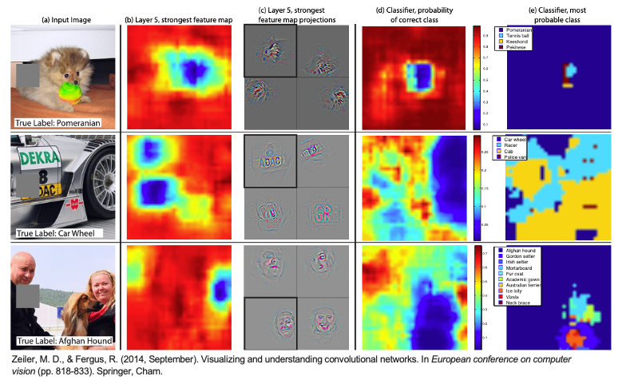
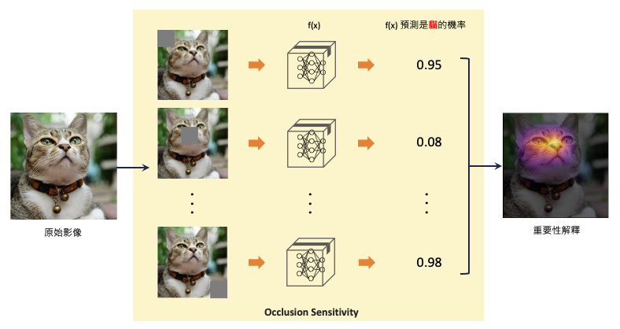
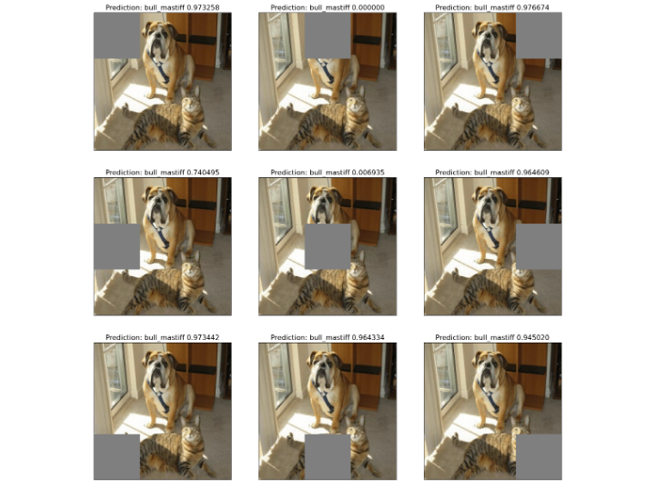
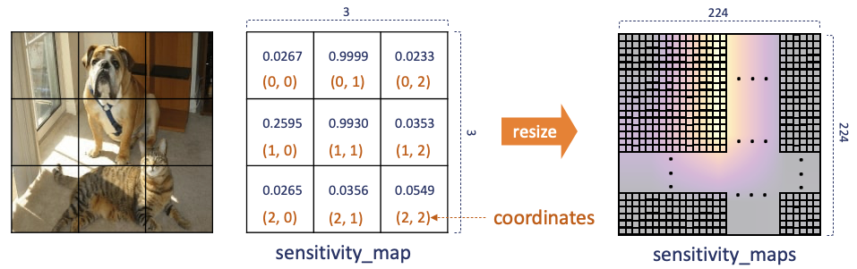

# [Day 19] Perturbation-Based：如何用擾動方法解釋神經網路
範例程式：[](https://colab.research.google.com/github/andy6804tw/crazyai-xai/blob/main/code/19.Perturbation-Based：如何用擾動方法解釋神經網路.ipynb)

如果想要了解一張圖片中哪些區域對於 CNN 神經網路的判斷結果具有影響力，可以參考基於擾動的 Perturbation-Based 方法。它有很多不同種的變形，其中最著名的是基於遮蔽擾動的方法，可以參考2014年於 Springer 發表的期刊論文：[Visualizing and understanding convolutional networks](https://arxiv.org/abs/1311.2901)。在這篇論文中，提出反卷積(Deconvolution)的作者 Zeiler 透過遮蔽圖片的一部分來觀察模型的輸出，以確定圖片中哪些區域對於模型的分類是相對重要的。實際上，作者也運用遮蔽反卷積和反池化的方法，驗證了這種技術確實能夠提供 CNN 的可解釋性。

> 參考論文：[Visualizing and understanding convolutional networks](https://arxiv.org/abs/1311.2901)

Perturbation-Based 方法不需要動到神經網路的架構，僅需要變動輸入的圖片，並從中觀察模型輸出的統計分佈。並試圖理解在哪個位置被遮擋後，會對最終的預測結果造成影響。因此造成最大影響的地方就可以被判定成圖片中最重要的關鍵區域，因為只要 CNN 無法看見重要區域就無法萃取關鍵特徵，相對的模型就無法正確的判斷。

## Occlusion Sensitivity (遮擋敏感度)
這篇論文提出了一種名為「遮擋敏感度（Occlusion Sensitivity）」的方法，它透過在圖片的特定部分進行遮擋，以觀察網路中間層的情況和預測值的變化。這有助於我們更好地理解為何網路會做出某些決策。簡單來說，遮擋敏感度是指當我們遮擋圖像的特定部分時，觀察預測機率如何隨之變化，進而找出圖片中的重要區域。


下圖為論文中的實驗結果。該實驗使用三個測試範例，分別進行系統性的遮擋，然後觀察神經網路的反應以及結果的變化。在這個實驗中，首先對每個範例圖片的不同區域應用了一個灰色方塊進行遮擋並預測，然後觀察了神經網路在第五層特徵圖的活化程度(b)，以及將特徵圖的訊息視覺化，並投影回原始輸入圖像，然後將其顯示出來(c)。(d)根據灰色方塊的位置，顯示該類別的機率分佈(可以從中發現藍色區塊代表越重要)。例如第一張圖當遮擋了狗的臉時，屬於 `pomeranian` (博美犬)這個類別的機率會明顯下降，因為神經網路無法看到狗的臉。最後(e)這一部分顯示了在不同遮擋位置時，最有可能的類別標籤。例如在第一張圖中，大部分情況下最可能的標籤是 `pomeranian` ，但如果遮擋了狗的臉而沒有遮擋到球，則它可能預測為 `tennis ball` (網球)。



> 從上圖(d)可發現如果欲辨識的目標物體被遮蔽的話那分類的準確度就會大大降低。

### Occlusion Sensitivity 的解釋過程
這種基於遮擋擾動的方法實作非常簡單。首先我們需要訓練一個效果良好的分類器，接著選取一張要解釋的圖片，並對該圖片的不同區域進行遮擋，同時監測模型的輸出機率。最後我們可以將 `(1-機率值)` 視為被遮擋區域的重要性程度。上述過程可以簡要概括為以下三個步驟：

1. 訓練分類器：訓練一個性能良好的分類器。
2. 遮擋圖像區域：選擇要解釋的圖片。對圖片的不同區域進行遮擋，形成不同的遮擋版本。
3. 監測輸出機率：觀察模型在每個遮擋版本下的輸出的預測機率。並使用(1-機率值)來評估被遮擋區域的重要性程度。

> 也可以使用(原始無遮擋影像的機率-遮擋後預測的機率)作為重要性的評估。

這裡的遮擋我們稱之為 patch(灰色小區塊)，而每個 patch 大小可以事先設定好。假設一張大小 `224*224` 的影像，每個遮擋 patch 大小設定為 `56*56`，總共會產生 16 張不同位置遮擋的版本(可以參考文章一開始的的動圖)。我們可以從結果發現經過遮擋貓的臉部該類別的機率大幅度的下降，也可以間接證實模型真的有學到預測貓要看臉部五官。



這種方法的優點在於容易實施，但缺點在於需要大量的計算資源。因此為了提高計算效率，每個 patch 不會重疊。此外 patch 的大小雖然可以隨意指定，但若重要的特徵範圍較大的話，使用小的 patch 可能會導致最後的解釋效果不佳。這強調了在選擇 patch 大小時需要考慮實際物體的大小，以確保解釋的準確性和有效性。

另外還記得 [Day1](https://ithelp.ithome.com.tw/articles/10318087) 我在文中所描述的辨識貓狗的例子嗎？我們也可以試著遮擋鈴鐺的部分，觀察模型是不是有學錯辨識貓的關鍵特徵。從下圖結果，即使把鈴鐺遮起來還是成功辨識出貓了。終於不是一個鈴鐺分類器了（汗。


## Perturbation-Based 方法實作 (Occlusion Sensitivity)
接下來我們使用 Google 的 Inception V3 預訓練模型來預測一張圖片，並試著使用遮擋擾動的技巧解釋模型。Inception V3 以其獨特的網路結構而聞名，它採用了所謂的`Inception Module`，這是一種多分支卷積結構，可以在不同尺度和方向上捕捉圖像特徵。這種結構使得網路能夠更有效地處理各種複雜的圖像，並提高了圖像分類的性能。


> Inception V3 論文：[Rethinking the Inception Architecture for Computer Vision (CVPR 2016)](https://arxiv.org/abs/1512.00567)

### 載入預訓練模型(Inception V3)
首先使用 TensorFlow 載入 Inception V3 模型，將輸入張量(tensor)連接到預訓練的神經網路層，`imagenet` 表示使用在 ImageNet 資料集上預訓練的權重。`include_top=True` 表示輸出包括模型的最後分類層(全連接層)，此模型通常用於影像分類任務。


```py
from tensorflow.keras.applications.inception_v3 import InceptionV3
from tensorflow.keras.layers import Input

# 建立一個輸入張量，指定圖像大小為224x224（RGB色彩通道）
input_tensor = Input(shape=(224, 224, 3))
# 建立 InceptionV3 模型
model = InceptionV3(input_tensor=input_tensor, weights='imagenet', include_top=True)
```

接著載入一張圖像，對其進行預處理。其中 `np.expand_dims()` 的目的是將圖像轉換為模型可接受的維度，這裡將圖像包裝在一個批次(batch)中，通常是一個批次只有一張圖像。最後使用 Inception V3 模型的預處理函數 `preprocess_input()` 來處理圖像，以確保圖像的數值範圍和格式符合模型的要求。

```py
import numpy as np
import tensorflow as tf
from tensorflow.keras.applications.inception_v3 import preprocess_input

# 載入圖像
image = tf.keras.utils.load_img('./dataset/cat_dog.jpg')
image = tf.keras.utils.img_to_array(image) # 將載入的圖像轉換為數組形式
x = np.expand_dims(image.copy(), axis=0) # 將圖像轉換為模型可接受的維度
# 預處理圖像
x = preprocess_input(x)
```

確認輸入影像都完成處理過後，就可以使用已建立的 Inception V3 模型進行圖像分類預測，返回分類機率。最後再使用 `decode_predictions()` 解析取得預測結果，並取得類別名稱和相對應的預測機率。`pred_class_idx` 則是預測的標籤索引，最後模型解釋會需要用到它。

```py
from tensorflow.keras.applications.inception_v3 import decode_predictions

# 進行圖像分類預測
pred_proba = model.predict(x) # 返回分類機率
# 解析預測結果
pred_class_idx = pred_proba.argmax(axis=1)[0]  # 找到具有最高機率的類別索引
pred_class = decode_predictions(pred_proba, top=1)[0][0]  # 解析取得預測結果
```

我們先來看看模型預測的結果。雖然這張影像同時有一隻貓和狗，但模型在神經網路中先抓取到狗的重要特徵(例如：鼻子、嘴巴)，因此最終模型預測 `bull_mastiff`(鬥牛獒)，該類別的機率值有 98% 這麼高。

```py
import matplotlib.pylab as plt

plt.imshow(image.astype('uint8'))
plt.axis('off')
predicted_class_name = pred_class[1]
_ = plt.title(f"Prediction: {predicted_class_name} {pred_class[2]:.2f}")
```


### Occlusion Sensitivity 實作
以下實現 Occlusion Sensitivity 方法，它對原始影像依序插入灰色方塊(patch)，然後遍歷這些方塊並計算它們對於模型預測的影響，最後生成 sensitivity_map 和 coordinates 以供進一步分析使用。由於影像大小為`224*224`，而每個 patch 大小 `75*75` 因此總共會生成 9 張圖並儲存在 patches。

```py
import math

batch_size = 16 # 批次大小，設定模型一次預測可以讀取幾張照片
patch_size = 75 # 方形灰色方塊大小
target_class_idx = pred_class_idx # 預測目標的標籤索引

# 定義一個函數，用於將灰色方塊(patch)置換到原始影像的指定位置
def apply_grey_patch(image, top_left_x, top_left_y, patch_size):
    patched_image = np.array(image, copy=True)
    # 置換指定區域的像素值為灰色（127.5），達到遮蔽的效果
    patched_image[
        top_left_y : top_left_y + patch_size, top_left_x : top_left_x + patch_size, :
    ] = 127.5

    return patched_image

# 用於記錄不同區域對於模型預測的影響(初始化為0)
sensitivity_map = np.zeros(
    (
        math.ceil(image.shape[0] / patch_size),
        math.ceil(image.shape[1] / patch_size),
    )
)
# 儲存所有遮擋的圖像
patches = [
    apply_grey_patch(image, top_left_x, top_left_y, patch_size)
    for index_x, top_left_x in enumerate(range(0, image.shape[0], patch_size))
    for index_y, top_left_y in enumerate(range(0, image.shape[1], patch_size))
]
# 建立一個坐標列表，用於記錄不同區域的坐標
coordinates = [
    (index_y, index_x)
    for index_x in range(
        sensitivity_map.shape[1]
    )
    for index_y in range(
        sensitivity_map.shape[0]
    )
]
```

上面程式為整個流程的前置作業，先把遮擋的圖像與原圖合成，並將九張不同遮擋位置的圖片儲存在 patches，接著初始化 sensitivity_map 為0，以及生成一個座標網格 coordinates 以利於後續實作。


> patch_size 的大小會影響解釋的結果，各位可以嘗試變動大小並觀察。

遮擋圖片都已準備好後，接著觀察每個方塊的不同位置遮擋對於模型預測的影響。我們將影像進行前處理，接著餵入先前已建立好的 Inception V3 模型，然後提取特定類別的預測機率值，在本範例中我們要觀察 `bull_mastiff` 類別的機率，最終這些機率值存儲在 target_class_probs 中供後續使用。

```py
# 建立模型輸入資料
inputs = np.array(patches, copy=True)
# 預處理圖像
inputs = preprocess_input(inputs)
# 進行圖像分類預測
pred_proba = model.predict(inputs, batch_size=batch_size)
# 取得 bull_mastiff 類別的機率
target_class_probs = [
    prob[target_class_idx] for prob in pred_proba
]
```

我們將剛剛計算出來的結果透過視覺化方式呈現。可以清楚的觀察每一張遮擋版本的圖像，以及相對應的類別機率為多少。
```py
# 計算網格大小，繪圖排版用
grid = math.ceil(image.shape[0]/patch_size)
# 建立一張圖包含多個子圖，並設定圖像的大小和排列方式
fig, ax = plt.subplots(nrows=grid, ncols=grid, figsize=(20, 20),
                       subplot_kw={'xticks':[], 'yticks':[]},
                       gridspec_kw=dict(hspace=0.2, wspace=0.1))
# 顯示每張遮擋版本的圖像
for i in range(len(patches)):
    # 設定每個子圖像的標題，包括預測的類別名稱和相應的機率值
    ax[i%grid, i//grid].set_title(f'Prediction: {predicted_class_name} {target_class_probs[i][0]:.6f}', fontsize=16)
    # 顯示子圖像，並將像素值除以255以將其正規化到0到1之間
    ax[i%grid, i//grid].imshow(patches[i]/255)
```



上一步驟已經觀察模型在每個遮擋版本下的輸出的預測機率。接下來計算每個子圖像的重要性（敏感程度）。我們使用1減去模型預測機率值，當成是那塊 patch 的重要性，這樣使得模型輸出較高的機率值將對應較低的重要性，反之亦然。因此相減之後的值越高，表示該遮擋灰色的區域越重要。最後將 sensitivity_map 的大小調整為與原始圖像相同的大小，每個像素將對應到原始圖像的相應位置，使得它可以與原始圖像一起使用或顯示。

```py
import cv2
import matplotlib.cm as cm

# 將 (1-機率值) 當成是那塊 patch 的重要性
for (index_y, index_x), confidence in zip(coordinates, target_class_probs):
    sensitivity_map[index_y, index_x] = 1 - confidence
# 調整為與原始圖像相同的大小
sensitivity_maps = cv2.resize(sensitivity_map, tuple(image.shape[0:2]))
```

> 重要性計算有很多種方法，也可以使用(原始無遮擋影像的機率-遮擋後預測的機率)。



每個區塊重要性都已經計算出來了，最後我們就 matplotlib 來視覺化結果吧！從結果可以發現，當我們遮擋狗的臉部會大幅度降低預判 `bull_mastiff` 類別的機率值。因此相對的可以得知辨識狗的關鍵特徵在於臉部特徵與四肢。

```py
fig, axs = plt.subplots(nrows=1, ncols=3, squeeze=False, figsize=(16, 8),
                        subplot_kw={'xticks':[], 'yticks':[]})

axs[0, 0].set_title('Original image', fontsize=20)
axs[0, 0].imshow(image/255)

axs[0, 1].set_title('Sensitivity maps', fontsize=20)
axs[0, 1].imshow(sensitivity_maps, cmap=cm.inferno)

axs[0, 2].set_title('Overlay', fontsize=20)
axs[0, 2].imshow(sensitivity_maps, cmap=cm.inferno)
axs[0, 2].imshow(image/255, alpha=0.4)
```


最後我們再進行一個有趣的實驗，如果我們遮住狗的臉，然後再次使用 InceptionV3 模型進行預測，你猜猜會得到什麼輸出？果然如預期，模型注意力轉向貓的特徵，最終輸出了 `tabby`（虎斑貓）。


## 小結
Perturbation-Based 還有許多不同的方法，例如我們可以自定義目標函數以及圖片遮擋的技巧(模糊化、數值替換、加入雜訊)。並針對一個模型每個輸入去尋找遮蔽哪裡可以獲得最佳的解釋性。也就是遮蔽了哪些地方，對模型模型分類的結果會造成最大的負影響。有興趣的人也可以參考這篇論文：[Interpretable Explanations of Black Boxes by Meaningful Perturbation](https://arxiv.org/abs/1704.03296)。


## Reference
- [[論文速速讀]Visualizing and Understanding Convolutional Networks](https://meetonfriday.com/posts/3013fdb9/#Experiments)
- [Google Cloud: Advanced Guide to Inception v3](https://cloud.google.com/tpu/docs/inception-v3-advanced)
- [Visualization of Convolutional Neural Networks in PyTorch](https://datahacker.rs/028-visualization-and-understanding-of-convolutional-neural-networks-in-pytorch/)
- [可解釋 AI (XAI) 系列 — 01 基於遮擋的方法 (Perturbation-Based): Occlusion Sensitivity, Meaningful Perturbation](https://medium.com/ai-academy-taiwan/%E5%8F%AF%E8%A7%A3%E9%87%8B-ai-xai-%E7%B3%BB%E5%88%97-01-%E5%9F%BA%E6%96%BC%E9%81%AE%E6%93%8B%E7%9A%84%E6%96%B9%E6%B3%95-perturbation-based-40899ba7e903)