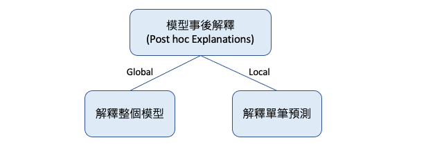
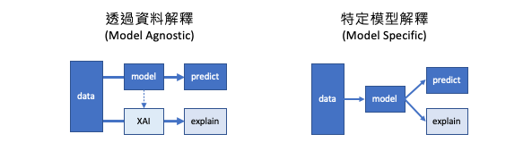

# [Day 2] 從黑盒到透明化：XAI技術的發展之路
近年來人工智慧技術發展迅速，深度學習等技術的出現和應用已經帶來了很多驚人的成果，尤其是 ChatGPT 的出現更讓人們驚嘆不已。然而這些模型的黑箱特性一直是人工智慧領域中的一個重要議題。為了解決這個問題，越來越多的研究者開始關注解釋性人工智慧技術的發展。XAI 技術在過去幾年中經歷了長足的發展，從最初的可視化技術到現在的基於規則的解釋、深度學習可解釋性技術、模型過程可解釋技術等等，不斷地推陳出新。這些技術的不斷革新和提高，讓人們對於機器學習模型決策過程的理解更加深入和全面，也提高了機器學習模型的可信度和實用性。今天的內容我們將探討 XAI 技術的發展之路，並介紹幾個具有代表性的 XAI 技術。

## XAI 學習地圖
下圖取自於 [Jay Alammar](https://ex.pegg.io) 的部落格，主要說明 XAI 技術中依據模型可解釋性的不同，分成了多種解釋方法。這些方法可分為模型本身具有可解釋性或是過於複雜難以解釋的情況。對於過於複雜的模型，我們需要透過事後分析技術來協助理解模型推論的邏輯。今天提到的所有名詞基本上彼此間都環環相扣，就讓我攘逐一為各位說明。

## Interpretable Models vs. Post hoc Explanations 
XAI 方法可分為模型本身可以解釋（Interpretable Models）與模型訓練完事後解釋（Post hoc Explanations）兩種。其中，模型本身可以解釋的方法包括：線性迴歸、邏輯迴歸、決策樹、K-nearest neighbors、貝葉斯網絡模型。這些模型在自身設計上就已經具有一定的解釋性，因此可以直接透過模型本身來解釋預測結果。

模型本身可以解釋:
- 線性迴歸 (Linear regression) / 邏輯迴歸 (Logistic regression)
  - 線性迴歸和邏輯迴歸模型通常是基於線性方程來預測目標特徵的值，因此可以很容易地解釋模型權重和特徵之間的關係。
- 決策樹 (Decision tree) 
  - 決策樹是基於樹結構的模型，因此可以通過樹的分支路徑來解釋模型的決策過程。
- K-nearest neighbors (KNN)
  - 由於 KNN 算法本身就是基於距離計算的，因此可以解釋模型是基於哪些最近鄰居的資料進行預測的。
- 貝葉斯網絡模型 (Bayesian Network Model)
  - 通過機率模型表示特徵之間的條件依賴關係，可用於推論和預測。

> 雖然隨機森林和XGBoost通常被認為是比較可解釋的tree-based系列模型，因為其結構相對簡單，可以直觀地理解每個決策的依據。但它們不算是Interpretable Models，因為其決策過程是由多個弱分類器或決策樹共同決定，其整體解釋性較難掌握，需要透過其他解釋方法來進行解釋。

Post hoc Explanations 指的是在模型訓練完畢後，使用額外的解釋方法來理解模型的行為和決策過程。這些方法通常是使用一些數據可視化或統計技術，來顯示模型中不同特徵之間的關係，以及這些特徵對模型結果的影響程度。常見的 Post hoc 解釋方法包括 Permutation Importance、Partial Dependence Plot (PDP)、Accumulated Local Effects (ALE)、SHapley Additive exPlanations (SHAP)、Local Interpretable Model-agnostic Explanations (LIME) 等等。這些方法可以用於解釋各種不同類型的模型，包括決策樹、神經網絡、支持向量機等等。

模型訓練完事後解釋:
- Local Interpretable Model-agnostic Explanations ([LIME](https://arxiv.org/abs/1602.04938))
- SHapley Additive exPlanations ([SHAP](https://arxiv.org/abs/1705.07874))

## Global vs. Local Explanations
剛所提到的模型訓練完事後解釋的方法又可分為 Global 解釋整個模型行為以及 Local 解釋單筆預測行為。Global 的方法的目的是理解模型對所有數據點的預測，而不僅僅是特定的數據點或觀測。這種方法通常涉及到解釋模型中的特徵重要性，即哪些特徵對於模型的預測影響最大。

解釋整個模型的行為，例如：
- Permutation Importance：隨機重排特徵，計算對模型準確度的影響
- Partial Dependence Plot (PDP)：顯示某個特徵對模型輸出的影響程度
- Accumulated Local Effects (ALE)：估計某個特徵對模型輸出的平均影響程度
- SHapley Additive exPlanations (SHAP)：計算每個特徵對預測值的貢獻程度

解釋單筆預測行為，例如：
- Local Interpretable Model-agnostic Explanations (LIME)：通過生成局部可解釋的模型來解釋單筆預測的結果。
- SHapley Additive exPlanations (SHAP)：透過給每個特徵一個權重，計算其對預測結果的貢獻。
- ICE（Individual Conditional Expectation）：與 PDP 類似，不同之處在於 ICE 將每個樣本視為一個獨立的個體，而 PDP 則將所有樣本視為同一個整體。

> SHAP 可以同時用於分析全局和局部貢獻，並提供有關每個特徵如何影響模型預測的詳細訊息。

## Model Agnostic vs. Model Specific
最後 XAI 的方法又可細分為 Model Agnostic 和 Model Specific 兩種。Model Agnostic 的方法是透過資料來解釋模型，例如先前提到的 LIME 和 SHAP 都是透過資料搭配方法來解釋模型的經典方法。

Model Agnostic 不考慮模型本身，只透過資料來解釋模型的方法：
- LIME、SHAP、PDP、ICE、ALE
- Anchor：透過找尋可以對預測結果產生重要影響的條件規則，來解釋模型的預測結果。
- Surrogate Model：使用另一個模型來近似模擬原始模型，並以此模型來進行解釋。常用的模型包括線性模型、決策樹等。

而 Model Specific 的方法則是針對特定模型來進行解釋。例如，決策樹系列的演算法透過樹的分支可知道每個節點的決策，而神經網路透過梯度下降法則可分析每個參數對於輸出的影響。這些方法有助於了解模型的內部運作，但缺點在於限制在特定模型上。

Model Specific 考慮模型本身，解釋模型本身的方法：
- Tree-based model：透過樹的分支可以知道每個節點的決策，以及每個變數對於決策的貢獻程度。
- 神經網路：透過梯度下降法可以分析每個參數對於輸出的影響，或是使用類神經網路的可視化技術來解釋模型。
- 模型融合方法(Stacking)：透過將多個模型進行結合，可以進一步提升預測準確度並探索每個模型對於整體預測的貢獻。

##  Python XAI 的套件有哪些？
以下是一些常用的 Python 可解釋 AI 工具：

- [SHAP](https://github.com/slundberg/shap) (SHapley Additive exPlanations)：可解釋性機器學習工具，提供全局和局部的解釋，並透過 Shapley 值計算影響預測的因素貢獻度。
- [LIME](https://github.com/marcotcr/lime) (Local Interpretable Model-Agnostic Explanations)：一種局部解釋模型的工具，能夠解釋模型在單個預測中每個特徵的重要性，不考慮模型本身。
- [scikit-learn Inspection](https://scikit-learn.org/stable/inspection.html)： sklearn 套件中的 inspection 提供了解釋整個模型行為的方法，幫助理解模型的預測以及觀察特徵重要程度。
- [ELI5](https://github.com/eli5-org/eli5) (Explain Like I'm Five)：支持多種模型解釋，包括線性模型、決策樹、隨機森林等，可用於解釋全局和局部的預測。
- [InterpretML](https://github.com/interpretml/interpret)：一個針對機器學習模型的解釋工具，提供全局和局部的解釋，並且可以解釋多個模型之間的比較。
- [What-if Tool](https://pair-code.github.io/what-if-tool/)：Google 開發的一種交互式可解釋性工具，能夠展示特定輸入對預測結果的影響，並提供調整輸入以觀察預測結果的功能。
- [Shapash](https://github.com/MAIF/shapash)：是一個針對機器學習模型的自動化報告工具，可以幫助使用者快速解釋並理解模型的預測結果。

除了上述幾個之外還包括 scikit-explain, Skope-rules, DTREEviz, H2O, Yellowbrick, PDPbox, Skater, Ciu, Dalex, Lofo, Anchor, PyCEbox, Alibi, Captum, AIX360, OmniXAI, L2X。這些都可以透過 Python 來輔助我們解釋訓練好的模型。

> 本系列將會挑選幾個具有代表性的工具介紹給各位邦友

## 小結
最後用這張圖表做個總結，並統整了今天所學習的內容。簡單來說，要解釋機器學習模型的結果，可以採用模型事後解釋或模型本身可解釋的方式。透過模型事後解釋，我們可以進一步了解模型在特定數據上的表現，以及模型背後的推論過程。而模型本身可解釋的模型則可以提供直接的解釋，因此可以更好地理解模型在不同情況下的預測結果。此外，解釋整個模型可以揭示模型的整體結構和特徵重要性，而解釋單筆預測可以幫助我們理解模型如何進行個別預測。透過資料解釋可以解釋各種不同類型的模型，而特定模型解釋則專注於針對特定類型的模型進行解釋。

明天我們就來談談這些關於機器學習中的可解釋性的指標

## Reference
- [Explainable AI Cheat Sheet by Jay Alammar (Arpeggio)](https://ex.pegg.io)
- [Developing and Experimenting on Approaches to Explainability in AI Systems](https://research-information.bris.ac.uk/ws/portalfiles/portal/305310441/ICAART_2022_226_CR.pdf)