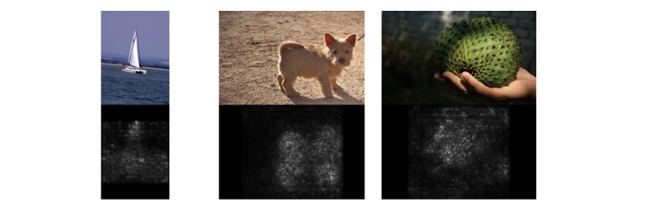
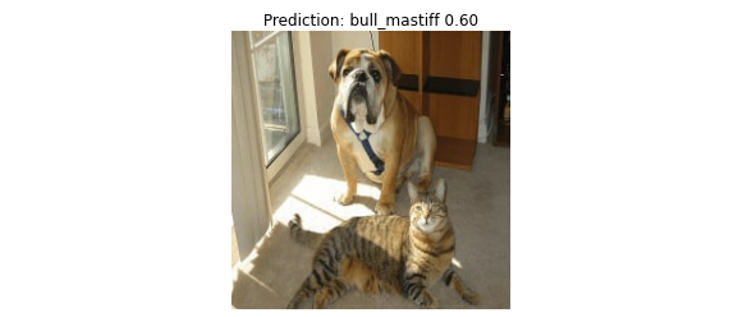

# [Day 20] Gradient-Based：利用梯度訊息解釋神經網路
範例程式：[](https://colab.research.google.com/github/andy6804tw/crazyai-xai/blob/main/code/20.Gradient-Based：利用梯度訊息解釋神經網路.ipynb)

在深度學習中梯度訊息扮演著關鍵的角色，尤其在神經網路的訓練過程中。梯度代表了函數相對於參數的變化率，它告訴我們如何調整神經網路的權重和參數，以最小化或最大化一個特定的損失函數。因此梯度下降法是優化神經網路的主要手段之一，它依賴梯度訊息來更新模型的參數，使其更好地適應訓練數據。

然而今天要談的是利用梯度訊息解釋神經網路，也就是當訓練一個神經網路後，透過計算神經網路對於輸入影像的梯度，我們就可以了解每個輸入特徵（例如像素）對於神經網路輸出的影響程度，並解釋神經網路的決策過程。以下是一些相關文獻，可以使用梯度訊息來表示輸入影像中每個特徵的重要度：

- [Image-Specific Class Saliency](https://arxiv.org/abs/1312.6034)(Simonyan et al., 2014)：該方法計算指定的類別的輸出對輸入影像的損失函數梯度，得到一個反映輸入特徵影響的 Saliency Map。
- [Input X Gradient](https://arxiv.org/abs/1605.01713) (Shrikumar et al., 2016)：這種方法簡單地將輸入影像的梯度與輸入影像本身相乘，以計算每個像素的重要度。這可以顯示哪些像素對於模型的預測具有最大的影響。
- [SmoothGrad](https://arxiv.org/abs/1706.03825) (Smikov et al., 2017)：此方法將輸入影像進行 n 次微小擾動，然後計算這些擾動下的梯度，最後將它們平均，獲得穩定的 Saliency Map。
- [Integrated Gradients](https://arxiv.org/abs/1703.01365) (Sundararajan et al., 2017)：這是一種方法，通過對輸入特徵的整合來計算梯度，以評估每個特徵對於預測的影響。它提供了一種平滑的方法，可以顯示每個特徵對於預測的貢獻程度，而不僅僅是單一點的梯度。
- [Grad-CAM](https://arxiv.org/abs/1610.02391)（Ancona et al., 2016）：它結合了卷積神經網路中的梯度訊息和特徵圖，以生成一個更具視覺解釋性的熱圖，顯示哪些區域在圖像中觸發了特定類別的預測。


## 透過權重與輸入的特徵來決定 Attribution
`Attribution` (歸因)是一個用於機器學習和深度學習領域的術語，它指的是試圖理解機器學習模型如何做出特定預測或決策的過程。以下使用一個簡單的線性迴歸例子，解釋 attribution 的概念。假設有兩個特徵會影響模型最終的輸出結果，那我想知道這兩個特徵的影響性分別有多大。通常可以使用偏微分（Partial Derivatives）來進行分析。這是數學上的一個方法，可以計算某個函數對於其中一個變數的偏導數，以評估該變數對函數值的影響。

我們可以用一個簡單的例子來解釋如何計算特徵對模型輸出的影響程度。假設我們有一個簡單的線性模型如下：


這個模型有兩個特徵，x1 和 x2，它們分別乘以不同的權重2和3。現在我們想知道 x1 和 x2 對 y 的影響程度。

1. 首先，我們計算對x1的偏導數：

    ∂y/∂x1 = 2

    這表示當 x1 增加1個單位時，y 會增加2個單位。所以，x1對 y 的影響是正向的，並且影響程度為2。

2. 接下來，我們計算對 x2 的偏導數：

    ∂y/∂x2 = 3

    這表示當 x2 增加1個單位時，y 會增加3個單位。所以，x2 對 y 的影響也是正向的，並且影響程度為3。

根據這個例子，我們可以得出結論，x2 對 y 的影響程度比 x1 大，因為 `∂y/∂x2` 的絕對值大於 `∂y/∂x1` 的絕對值。這是一個極簡單的例子，實際上的模型可能更複雜，但這個方法可以用來評估不同特徵對模型輸出的相對影響程度。此外這個方法假設模型是線性的，並且特徵之間不存在交互作用，對於複雜的非線性模型，可以使用一階泰勒展開式把它近似成線性模型。


## Image-Specific Class Saliency (Sensitivity Analysis)
這裡介紹一個簡單的 Gradient-Based 方法，就是 Image-Specific Class Saliency(圖像特定類別顯著性)，也有些文獻稱它 Sensitivity Analysis (敏感度分析)。可以藉由計算輸入圖像的每個 pixel 的梯度，獲取 Saliency Map。整體步驟流程如下：

1. 模型推論：首先將一張影像餵入深度學習模型進行前向傳遞，獲得模型對該圖像的分類結果。
2. 計算梯度：針對我們感興趣的分類類別，計算該類別分數相對於輸入像素的梯度。這些梯度值反映了每個像素對於該類別預測的重要程度。
3. 視覺化結果：將計算得到的梯度視覺化呈現。可以選擇顯示絕對值的梯度，或者將正貢獻和負貢獻分開呈現，以突顯圖像中對於該類別預測影響最大的區域。這有助於理解模型為何將注意力集中在特定部分以做出特定的分類決策。



對數學與推導過程有興趣的讀者可以參考以下這份電子書。在文中作者稱上述方法為 Vanilla Gradient。

> 延伸閱讀：[vanilla-gradient-saliency-maps](https://christophm.github.io/interpretable-ml-book/pixel-attribution.html#vanilla-gradient-saliency-maps)

## Gradient-Based 方法實作 (Image-Specific Class Saliency)
在今天的範例中所使用的預訓練模型為 ResNet50。使用的方式跟昨天幾乎一模一樣，都是採用 `tf.keras.applications` 內建所提供的模型參數。ResNet50 突破了深度神經網路 Deep 的受限，引入了殘差學習的概念。通常隨著神經網路層數的增加，模型的性能會變得更好，但在一定深度後，模型會遭遇梯度消失或梯度爆炸的問題，導致訓練變得困難。因此 ResNet 引入 Residual Block（殘差模塊）允許訊息在不同層之間跳躍（即跳過某些層），進而解決了這個問題。


> ResNet 論文： [Deep Residual Learning for Image Recognition](https://arxiv.org/abs/1512.03385) (CVPR 2016 best paper)

### 載入預訓練模型(ResNet50)
首先使用 TensorFlow 載入 ResNet50 模型，將輸入張量(tensor)連接到預訓練的神經網路層，`imagenet` 表示使用在 ImageNet 資料集上預訓練的權重。`include_top=True` 表示輸出包括模型的最後分類層(全連接層)，此模型通常用於影像分類任務。

```py
from tensorflow.keras.applications.resnet50 import ResNet50
from tensorflow.keras.layers import Input

# 建立一個輸入張量，指定圖像大小為224x224（RGB色彩通道）
input_tensor = Input(shape=(224, 224, 3))
# 建立 ResNet50 模型
model = ResNet50(input_tensor=input_tensor, weights='imagenet', include_top=True)
```

接著載入一張圖像，對其進行預處理。其中 `np.expand_dims()` 的目的是將圖像轉換為模型可接受的維度，這裡將圖像包裝在一個批次(batch)中，通常是一個批次只有一張圖像。最後使用 ResNet50 模型的預處理函數 `preprocess_input()` 來處理圖像，以確保圖像的數值範圍和格式符合模型的要求。

```py
import numpy as np
import tensorflow as tf
from tensorflow.keras.applications.resnet50 import preprocess_input

# 載入圖像
image = tf.keras.utils.load_img('./dataset/cat_dog.jpg')
image = tf.keras.utils.img_to_array(image) # 將載入的圖像轉換為數組形式
x = np.expand_dims(image.copy(), axis=0) # 將圖像轉換為模型可接受的維度
# 預處理圖像
x = preprocess_input(x)
```

確認輸入影像都完成處理過後，就可以使用已建立的 ResNet50 模型進行圖像分類預測，返回分類機率。最後再使用 `decode_predictions()` 解析取得預測結果，並取得類別名稱和相對應的預測機率。`pred_class_idx` 則是預測的標籤索引，最後模型解釋會需要用到它。

```py
from tensorflow.keras.applications.resnet50 import decode_predictions

# 進行圖像分類預測
pred_proba = model.predict(x) # 返回分類機率
# 解析預測結果
pred_class_idx = pred_proba.argmax(axis=1)[0]  # 找到具有最高機率的類別索引
pred_class = decode_predictions(pred_proba, top=1)[0][0]  # 解析取得預測結果
```

我們先來看看模型預測的結果。雖然這張影像同時有一隻貓和狗，但模型在神經網路中先抓取到狗的重要特徵(例如：鼻子、嘴巴)，因此最終模型預測 `bull_mastiff`(鬥牛獒)，該類別的機率值有 60%。有興趣的讀者，也可以跟昨天的模型進行比較。

```py
import matplotlib.pylab as plt

plt.imshow(image.astype('uint8'))
plt.axis('off')
predicted_class_name = pred_class[1]
_ = plt.title(f"Prediction: {predicted_class_name} {pred_class[2]:.2f}")
```



### Image-Specific Class Saliency 實作
首先我們將此演算法包裝成一個函式方便呼叫。這一個函式主要接受兩個參數：

- image: 包含一組圖像的輸入數據，這些圖像是要計算特定類別顯著性的對象。
- target_class_idx: 指定要計算特定類別顯著性的目標類別的標籤索引。

其中為了要進行梯度的計算，我們需要將輸入的圖片從 numpy array 轉換成 TensorFlow Tensor 格式。最後的 return 是計算目標類別機率 `probs` 對於輸入圖像 `image` 的梯度。`tape.gradient` 函數接受兩個參數，分別是梯度的目標和原影像，這裡我們希望計算目標是 `probs` 相對於輸入影像 `image`。

```py
def compute_gradients(image, target_class_idx):
    image = tf.convert_to_tensor(image)  # 將輸入的影像轉換為 TensorFlow 張量
    with tf.GradientTape() as tape:  # 用於計算梯度
        tape.watch(image)  # 監控圖像，以便計算其梯度
        predictions = model(image)  # 使用模型進行預測
        probs = predictions[:, target_class_idx]  # 取得目標類別的預測機率
    return tape.gradient(probs, image)  # 計算機率對於影像的梯度並返回
```


接著我們馬上將剛剛測試的 RestNet50 預測鬥牛獒的結果放進去此函式進行解釋。這段程式碼的目的是計算梯度並生成一個歸因遮罩（attribution mask）。首先呼叫 compute_gradients 函式，並傳入一個影像 x 和目標類別的索引  pred_class_idx。該函式會計算影像對於目標類別的梯度，並將結果儲存在  gradients 變數中。 接著使用 tf.squeeze 函式將 gradients 張量的多餘維度去除，然後使用 tf.math.abs 函式計算絕對值。這樣做是為了確保梯度的正負號不影響歸因遮罩的生成。最後使用 tf.reduce_sum 函式將計算結果沿著最後一個維度（通道軸）相加，生成最終的歸因遮罩，並將結果儲存在 attribution_mask 變數中。 

```py
# 計算機率對於影像的梯度
gradients = compute_gradients(
    image=x,
    target_class_idx=pred_class_idx)
# 產生可解釋的遮罩
attribution_mask = tf.reduce_sum(tf.math.abs(tf.squeeze(gradients)), axis=-1)
```

最後讓我們瞧瞧結果。

```py
import matplotlib.cm as cm

fig, axs = plt.subplots(nrows=1, ncols=3, squeeze=False, figsize=(16, 8),
                        subplot_kw={'xticks':[], 'yticks':[]})

axs[0, 0].set_title('Original image', fontsize=20)
axs[0, 0].imshow(image/255)

axs[0, 1].set_title('Attribution Mask', fontsize=20)
axs[0, 1].imshow(attribution_mask, cmap=cm.inferno)

axs[0, 2].set_title('Overlay', fontsize=20)
axs[0, 2].imshow(attribution_mask, cmap=cm.inferno)
axs[0, 2].imshow(image/255, alpha=0.4)
```


## Reference
- [Towards better understanding of gradient-based attribution methods for Deep Neural Networks](https://arxiv.org/abs/1711.06104)
- [可解釋 AI (XAI) 系列 — 02 基於梯度的方法 (Gradient-Based): Sensitivity analysis, SmoothGrad, Integrated Gradients](https://medium.com/ai-academy-taiwan/%E5%8F%AF%E8%A7%A3%E9%87%8B-ai-xai-%E7%B3%BB%E5%88%97-02-%E5%9F%BA%E6%96%BC%E6%A2%AF%E5%BA%A6%E7%9A%84%E6%96%B9%E6%B3%95-gradient-based-b639932c1620)
