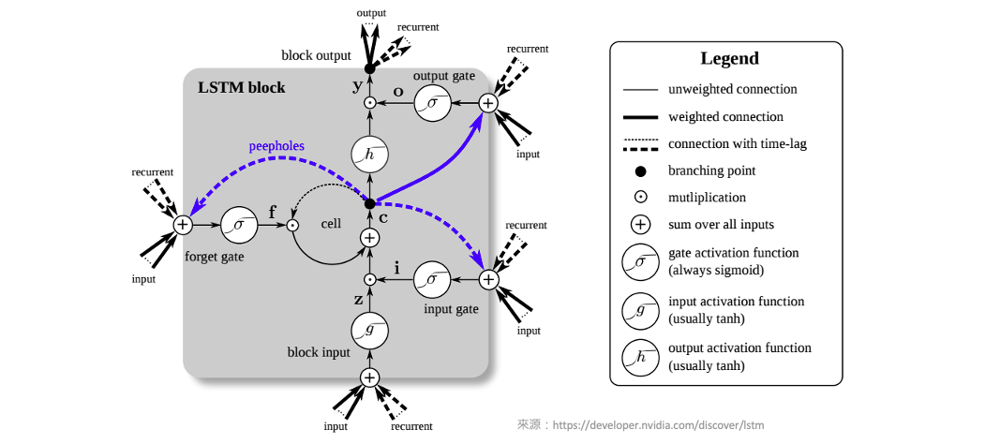
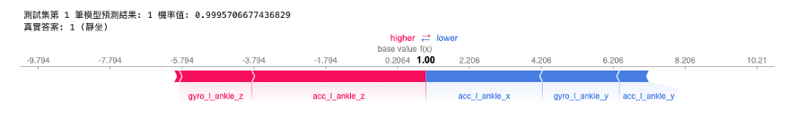

# [Day 24] LSTM的可解釋性：從時序資料解析人體姿態預測
範例程式：[](https://colab.research.google.com/github/andy6804tw/crazyai-xai/blob/main/code/24.LSTM的可解釋性：從時序資料解析人體姿態預測.ipynb)

在這個系列中，我們已經介紹了深度神經網路中的DNN（深度神經網路）和CNN（卷積神經網路），以及它們如何透過不同的方法進行模型解釋。今天，我們將深入探討如何使用 Deep SHAP 方法來解釋長短期記憶網路（LSTM）模型。LSTM 是一種特殊類型的循環神經網路（RNN），用於處理時間序列資料以及具有長期依賴性的序列任務。LSTM 的主要特點是它能夠有效地捕捉和記憶過去的訊息，以便在處理未來的時間步時進行預測。

LSTM 之所以強大，是因為它具有以下關鍵結構和機制：
- Cell State： LSTM具有記憶單元，可以存儲和檢索過去的訊息，這使得它能夠處理長序列資料，並保持對序列中先前訊息的適當記憶。
- Hidden State：LSTM還具有一個隱藏狀態，它是根據當前輸入和先前的隱藏狀態計算而來。隱藏狀態包含了當前時間步的信息，並用於生成預測。
- 三個控制門(Gate)：LSTM包含三個訊息控制單元的結構，分別是遺忘門（Forget Gate）、輸入門（Input Gate）和輸出門（Output Gate），通常會搭配Cell State和Hidden State控制輸出訊息。



> Deep SHAP 介紹可以參考：[[Day 17] 解析深度神經網路：使用Deep SHAP進行模型解釋](https://ithelp.ithome.com.tw/articles/10331443)

## [實作] Mobile Health Human Behavior Analysis
在今日的範例中我們將採用 [Mobile HEALTH](http://archive.ics.uci.edu/dataset/319/mhealth+dataset) 公開資料集，以建立 LSTM 時間序列模型，並用於預測人體動作辨識。該資料集包含了十名來自不同族群的志願者，在參與各項活動時，記錄了他們的外部感測器數值和生理訊號。接下來的實作中，我們僅使用了其中一位受試者的左腳踝三軸加速度（x、y、z）和陀螺儀（x、y、z）的資料，總共有六項特徵。這些資料以每秒50次的取樣率進行記錄(50Hz)，每種不同的動作分別持續了一分鐘，包括以下五種姿態：

- L1: 站立 (1 min)
- L2: 靜坐 (1 min)
- L3: 平躺 (1 min)
- L4: 走路 (1 min)
- L5: 上樓 (1 min)


從下圖中，我們可以觀察前500個資料點（約為10秒間隔）的訊號變化情況。在這段時間內，我們可以觀察到站立、靜坐和平躺等狀態的訊號變化相對較平穩，但仍可以通過旋轉角度和方位的變化來進行辨識。此外走路和上樓等動作則展現出明顯的訊號週期性，這些特徵可以被用來進行動作辨識。


> 原始資料單位：加速度(m/s^2), 陀螺儀角速度(deg/s)

## 載入資料集
首先我們透過 pandas 套件讀取一位受試者的訓練資料。這一份 csv 檔案中共有 161280 筆資料，其中包含數入訊號以及相對應標籤共有7個欄位。

- 輸入特徵
    - acc_l_ankle_x(左腳踝加速度x)
    - acc_l_ankle_y(左腳踝加速度y)
    - acc_l_ankle_z(左腳踝加速度z)
- 輸出標籤
    - Label 0~12 (今日範例只拿L1~L5)

```py
import pandas as pd
df_data =  pd.read_csv('https://github.com/andy6804tw/crazyai-xai/raw/main/dataset/mHealth_subject1.csv')
x_feature_names = ['acc_l_ankle_x','acc_l_ankle_y','acc_l_ankle_z','gyro_l_ankle_x','gyro_l_ankle_y','gyro_l_ankle_z']
y_feature_name = ['label']
y_label_names = ['站立', '靜坐', '平躺', '走路', '上樓']
df_data = df_data[x_feature_names + y_feature_name]
```


這一份資料集總共有 L0~L12 共13種標籤各自代表不同的姿態，其中在今天的範例中我們僅從資料集中提取 L1~L5 五種類別，依序分別代表`站立`、`靜坐`、`平躺`、`走路`、`上樓`。

```py
L1 = df_data.loc[ df_data.label == 1] #L1: 站立 (1 min) 
L2 = df_data.loc[ df_data.label == 2] #L2: 靜坐 (1 min)
L3 = df_data.loc[ df_data.label == 3] #L3: 平躺 (1 min)
L4 = df_data.loc[ df_data.label == 4] #L4: 走路 (1 min)
L5 = df_data.loc[ df_data.label == 5] #L5: 上樓 (1 min)
```

## 資料預處理
這段程式碼的主要目的是根據指定的窗口大小（window_size）和間隔（shift），從給定的時間序列資料中提取觀察資料（X）和相應的預測資料（y）。每個觀察資料是一個連續時間段內的資料，而預測資料則是該時間段後的一個時間點的特定特徵值。
```py
# 抓取window_size的資料作為觀察資料(x), 預測下一時間點步態(y)
def window_data(data, window_size, shift):
    X = []
    y = []
    i = 0
    while (i + window_size) <= len(data) - 1:
        # 將連續的window_size時間段內的資料（去除最後一個特徵label）作為觀察資料x
        X.append(data[i:i+window_size, :-1])
        # 將接下來的一個時間點的第6個特徵（標籤）作為預測資料y
        y.append(data[i+window_size, 6])
        i += shift  # 移動索引，以繼續抓取下一筆資料
    X = np.array(X)
    y = np.array(y).reshape(-1)
    assert len(X) == len(y)  # 確保觀察資料和預測資料的數量一致
    return X, y  # 返回處理後的時序資料和預測資料
```

簡單來說以站立資料採樣為例，約1分鐘3072筆的資料，每筆時序資料取視窗大小100點資料，接著移動20點再另外收集。因此每筆訓練資料的輸入維度應該為 (100,6)，100代表 window_size 也就是要看幾筆的資料點，而 6 代表不同感測器所截取的數值左腳踝加速度(x,y,z)和陀螺儀(x,y,z)。我們分別將 L1~L5 資料依據時間點進行採樣組成多筆時序資料，最後再透過 `np.concatenate()` 將所有資料合併成 X 和 y。另外需注意的是在處理 y 的時候 `-1` 操作是為了將標籤從 1、2、3、4、5 轉換為 0、1、2、3、4，使標籤從0開始編號，因為在訓練神經網路的時候分類的標籤都是從0開始。

```py
# 蒐集六個訊號100個時間點(window_size)，每筆資料採樣移動20個資料點
X_L1, y_L1 = window_data(L1.values, window_size=100, shift=20)
X_L2, y_L2 = window_data(L2.values, window_size=100, shift=20)
X_L3, y_L3 = window_data(L3.values, window_size=100, shift=20)
X_L4, y_L4 = window_data(L4.values, window_size=100, shift=20)
X_L5, y_L5 = window_data(L5.values, window_size=100, shift=20)

X = np.concatenate([X_L1, X_L2, X_L3, X_L4, X_L5])
y = np.concatenate([y_L1, y_L2, y_L3, y_L4, y_L5])-1 # 標籤要從0開始故全部減一

print("X shape: ",X.shape)
print("y shape: ",y.shape)
```

輸出結果可以看到總共有 745 筆資料， window_size 為 100，每一筆時序資料共有 6 項特徵。
```
X shape:  (745, 100, 6)
y shape:  (745,)
```

資料準備就緒後最後一個步驟就是將 X 和 y 切割訓練集與測試集。

```py
from sklearn.model_selection import train_test_split

X_train, X_test, y_train, y_test = train_test_split(X, y, test_size = 0.1, random_state=42, stratify=y)
print("X_train shape = ",X_train.shape)
print("X_test shape = ",X_test.shape)
print("y_train shape = ",y_train.shape)
print("y_test shape = ",y_test.shape)
```

輸出結果：
```
X_train shape =  (670, 100, 6)
X_test shape =  (75, 100, 6)
y_train shape =  (670,)
y_test shape =  (75,)
```

## LSTM 模型建立
以下程式碼使用 Tensorflow2.0 Functional API 搭建神經網路。此模型架構是用於處理時間序列資料並進行分類任務。模型的輸入是具有6個傳感器特徵的時間序列資料，每筆資料包含100個時間點。模型包括一個 LSTM 隱藏層，用於捕捉時間序列的時間相關性，其中 `return_sequences=True` 並將每個神經元的隱藏狀態(hidden_state)回傳，並透過 `Flatten()` 將所有時間的隱藏狀態攤平成一維向量傳給輸出層。最後通過一個全連接層進行分類，將輸入資料分為5個不同的類別。

```py
from tensorflow.keras.models import Model
from tensorflow.keras import models
from tensorflow.keras import layers
from tensorflow.compat.v1.keras.backend import get_session
tf.compat.v1.disable_v2_behavior()

num_sensor = 6
window_size = 100
def build_model():
    model_input = layers.Input(shape=(window_size, num_sensor))
    # 第一層隱藏層
    x = layers.LSTM(2, activation='relu', return_sequences=True, return_state=False)(model_input)
    x = layers.Flatten()(x)
    # 輸出層
    model_output = layers.Dense(5, activation='softmax')(x)
    return Model(model_input, model_output)
```

> 由於 SHAP 目前還尚未支援 TF2.4 版本以上，因此必須透過 `tf.compat.v1.disable_v2_behavior()` 關閉一些 2.0 版本的進階 API。

接下來，使用先前定義的 build_model() 函數建立一個新的神經網絡模型，並將這個模型存儲在 model 變數中。最後使用 model.summary() 印出模型的摘要訊息，包括模型的結構、每一層的參數數量等。

```py
tf.keras.backend.clear_session()
model = build_model()
model.summary()
```


模型準備就緒後即可開始訓練模型。由於我們沒有針對輸出標籤進行 `one-hot encoding` 因此可以在 loss 指定 `sparse_categorical_crossentropy`，這樣在模型訓練過程中自動地會進行額外處理以利於 cross entropy 的計算。由於訓練資料沒有很多，因此批次大小設為 4 表示每次訓練過程中，模型會同時處理4筆訓練資料。訓練迭代次數為 10 次。最後使用訓練數據 X_train 和 y_train 來訓練模型。

```py
# 編譯模型
model.compile(
      loss='sparse_categorical_crossentropy',
      optimizer='adam',
      metrics=['acc'])
# 訓練模型
history = model.fit( X_train, y_train, 
                    validation_split=0.1,
                    batch_size=4,
                    epochs=10)
```


## Deep SHAP 解釋 LSTM 模型
這裡採用 SHAP 套件中的 Deep SHAP 進行深度神經網路模型的解釋，它結合了 DeepLIFT 和 Shapely values 的概念，以計算每個特徵對於模型預測的貢獻。首先建立一個 DeepExplainer 解釋器，他除了 DNN 模型可以解釋之外，其他類型的神經網路像是 LSTM、CNN、1DCNN 都可以透過它來對模型進行特徵歸因的重要性解釋。另外在估計 Shapely values 時，可以輸入要解釋的資料。在這個範例中，我們將使用75筆測試集資料進行模型解釋。

```py
import shap
shap.initjs()

# 使用 Deep SHAP 解釋模型
explainer = shap.DeepExplainer(model=model, data=X_train)
# 估計 Shapely values
shap_values = explainer.shap_values(X_test)
```

由於我們需要處理大量的測試集資料，所以輸入資料的維度為(75, 100, 6)。這裡的每個數值代表的含義分別是(資料筆數, 時間窗口大小, 特徵數)。最後我們可以觀察到，在處理時間序列資料計算 Shapely values 時，輸出的維度將是(5, 75, 100, 6)。這是因為這個模型是一個輸出五類別機率的分類任務，所以在計算 Shapely values 時，會針對每一筆資料分別計算五個類別對應的 Shapely values。

```py
# 5個類別, 75筆測試資料, 100個時間點, 6個特徵
np.array(shap_values).shape
```

輸出結果：
```
(5, 75, 100, 6)
```

### SHAP Summary Plot (全局解釋)
我們可以針對75筆測試資料進行每個類別的特徵重要程度排序。接著透過變數 `label` 的設定可以觀察在某標籤下每個特徵對於整體平均貢獻的值。由於 Shapely values 會針對窗口的大小進行每個時間點的特徵歸因計算。因此每筆資料在某個類別的 Shapely values 維度是二維的(100, 6)，所以在進行全局模型解釋前要手動的將每筆測試資料的時間點根據每個特徵維度進行相加得到每個特徵的貢獻程度。最後計算出來六個數值再通過一個標準化，得到在某標籤下每個特徵對於整體平均貢獻的值。

```py
def normalize_array(arr):
    # 計算陣列中所有元素的總和
    total = sum(arr)
    # 正規化每個元素
    normalized_arr = [x / total for x in arr]
    return normalized_arr
```

```py
# 獲得在某標籤下每個特徵對於整體平均貢獻的值
# 0:站立、1:靜坐、2:平躺、3:走路、4:上樓
label=0
shap_value = np.array(shap_values)
shap_value = np.absolute(shap_value[label])
shap_value = np.sum(shap_value, axis=1)
SHAP_list = [np.sum(shap_value[:, 0]), np.sum(shap_value[:, 1]), np.sum(shap_value[:, 2]), np.sum(shap_value[:, 3]), np.sum(shap_value[:, 4]), np.sum(shap_value[:, 5])]
plt.barh(x_feature_names, normalize_array(SHAP_list), label=y_label_names[label], color='#028bfb')
plt.legend()
plt.show()
```

我們可以參照文章一開始觀察原始訊號圖，並發現各種步態可以很清楚地透過加速度規訊號進行判斷。因此在模型的推論過程中，主要依賴於加速度資訊，具體來說是 acc_x、acc_y 和 acc_z 這三項資訊。果然在 SHAP 模型解釋中，判斷各種類別的重要性都是以那三項資訊為主要依據。另外需注意的是，在本範例中，我們尚未對所有資料進行標準化，因此各位讀者也可以嘗試對資料進行標準化，看看是否會對模型的預測結果產生不同的解釋結果。


### SHAP Force plot (單筆資料解釋)
我們從資料集中選取了75筆資料作為測試集。剛才提到的全局解釋是針對這75筆資料的整體平均進行的解釋。現在我們可以進一步針對每一筆數據進行解釋分析。在下面程式中的 `index` 被設定為0，這表示我們要觀察測試集中的第一筆資料。然後，我們使用force_plot函式對這筆資料進行預測，並將分析結果以視覺化方式呈現。

```py
# 觀察測試集中第一筆資料的重要程度
index=0
pred_class = model.predict(X_test[[index]]).argmax()
pred_proba = model.predict(X_test[[index]])[0][pred_class]
print(f'測試集第 {index+1} 筆模型預測結果: {pred_class} 機率值: {pred_proba}')
print(f'真實答案: {int(y_test[index])}')
shap_value = shap_values[pred_class][index]
shap_value = shap_value.sum(axis=0)
shap.force_plot(explainer.expected_value[pred_class], shap_value, feature_names=x_feature_names)
```

從下圖視覺化解釋結果可以看到模型在這一筆資料預測標籤 1（靜坐），其機率值為 0.99。紅色的特徵表示將正向的影響輸出機率，會使值升高，藍色的則相反，會用來降低輸出機率。




### SHAP waterfall plot (單筆資料解釋)
我們可以更近一步的觀察該筆資料每個特徵對於輸出某個類別的 Shapely values 數值，以及判斷該類別的基準值是多少。下圖中每個特徵相對應的 Shapely value 累加，並加上基準值 `E[f(x)]=0.206` 最終相加的結果就是該筆測試資料預測某類的的機率值。

```py
pred_class = model.predict(X_test[[index]]).argmax()
pred_proba = model.predict(X_test[[index]])[0][pred_class]
shap_value = np.array(shap_values)
shap_value = np.expand_dims((shap_value[pred_class])[index], axis=0)
shap_value = np.sum(shap_value, axis=1)[0]
shap.waterfall_plot(shap.Explanation(values=shap_value, 
                                    base_values=explainer.expected_value[pred_class],  
                                    feature_names=x_feature_names))
```

下圖範例是預測第一筆測試資料在標籤為1的時候的 Shapely values 數值。


> 加總結果： 0.206-3.245-0.815+4.84+0.138-2.142+2.017=0.99

## 小結
個人目前觀察 SHAP 套件中的 Deep SHAP 在官方的例子中是 LSTM 自然語言的例子為主。然而在 LSTM 模型於分類或迴歸的模型，SHAP 套件無法直接進行解釋，必須透過小小的前處理透過特徵的維度將每個時間因子的 Shapely values 先加總再送進去 `force_plot` 進行解釋。此外目前套件尚未針對最新版 TensorFlow 進行優化，所以使用上會受到一些限制。如果對時間序列模型解釋有需求的讀者，也可以參考 [TimeSHAP: Explaining Recurrent Models through Sequence Perturbations](https://arxiv.org/abs/2012.00073) 這篇研究，以及相關的實作 [TimeSHAP](https://github.com/feedzai/timeshap) 這些資源或許會更適合處理時間序列模型的解釋需求。

## Reference
- [[forecast][LSTM+SHAP]Applied SHAP on the polynomial equation case with LSTM algorithm](https://medium.com/@sakamoto2000.kim/applied-shap-on-the-polynomial-equation-case-with-lstm-algorithm-7c140d15736b)
