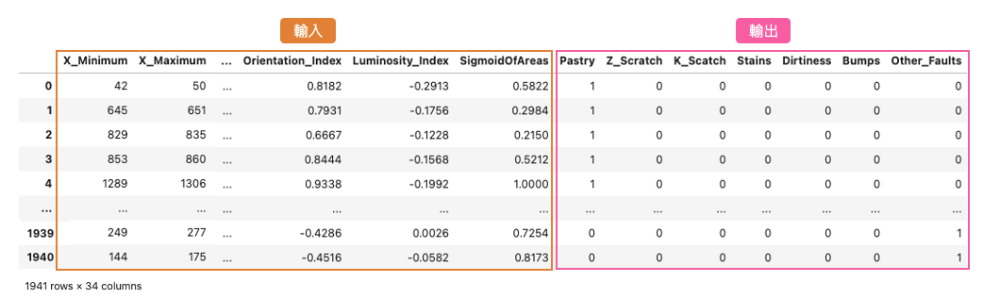
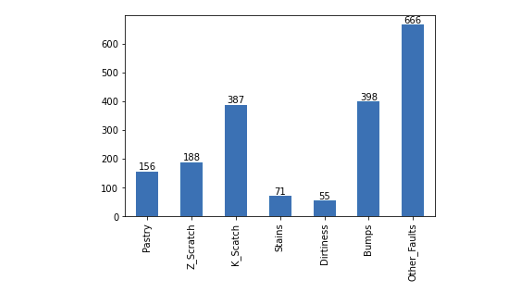
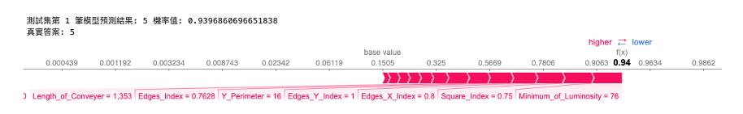
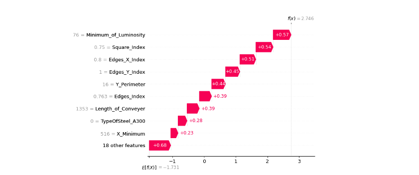
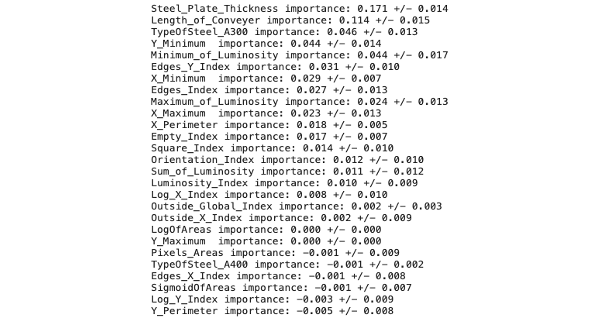

# [Day 26] XAI在表格型資料的應用：解析智慧工廠中的鋼材缺陷
範例程式：[](https://colab.research.google.com/github/andy6804tw/crazyai-xai/blob/main/code/26.XAI在表格型資料的應用：解析智慧工廠中的鋼材缺陷.ipynb)


在當今的工業領域中，智慧製造、碳中和以及數位雙生等議題受到廣泛關注。其中機器學習技術已經開始發揮關鍵作用，特別是在虛擬量測和異常檢測方面。在今天的內容中將帶各位深入探討工業應用實戰案例，即基於機器學習演算法的[鋼材缺陷偵測分類](https://archive.ics.uci.edu/dataset/198/steel+plates+faults)。

## [案例] 鋼鐵缺陷分類
本案例使用的資料集來自 UCI（加州大學爾灣分校）的開放數據平台，這個平台致力於為機器學習研究者和實踐者提供高品質的資料集。該資料集涵蓋了鋼材製造過程中可能出現的多種缺陷情況，其中包含了7種帶鋼缺陷類型，具體分別是 Pastry、Z_Scratch、K_Scatch、Stains、Dirtiness、Bumps、Other_Faults。另外這個資料集是一個表格型的資料集，特別適用於機器學習和數據分析。它包含了27種不同的特徵，這些特徵描述了帶鋼的不同屬性和特點，如缺陷的大小、形狀、位置等等。這些數據都是在製造或生產過程中收集的，每一筆資料都有相對應的標籤，即缺陷種類。



表格型資料通常以逗號分隔檔(csv)呈現，每一列(row)代表一個觀測值或樣本，而每一行(col)代表一個特徵或標籤。在這個特定的資料集中，每一列可能代表一個時間點或生產批次，而每一行代表一組製程參數以及對應的標籤種類。這份資料集比較特別的是輸出的標籤是以 one hot encoding 的方式呈現。在等等的實作中我們必須將這些資料進行前處理，並取得相對應的標籤索引。

### 載入資料集
首先透過 pandas 載入事先準備好的資料集。將 csv 檔案中的數據讀取並存儲在名為 df_data 的 DataFrame 變數中，以便後續的數據分析和處理。

```py
import numpy as np
import pandas as pd

url = 'https://raw.githubusercontent.com/andy6804tw/crazyai-xai/main/dataset/stell-faults.csv'
df_data = pd.read_csv(url)
```

接著我們必須從 df_data 分離輸入特徵 X 與標籤 y。首先從資料集中提取出特徵欄位的名稱，然後將這些特徵的數據提取出來，存儲在變數 X 中。接著從資料中提取了包含標籤的 one hot encoding 數據，然後使用 `argmax()` 找到每個 one hot 向量中的最大值索引，將其視為對應的標籤，最終將這些標籤存儲在變數 y_labels 中。

```py
x_feature_names = df_data.columns[:-7].values # 取得特徵欄位名稱
X = df_data[x_feature_names].values # 取出訓練資料特徵
y_label_names = df_data.columns[-7:].values # 取得標籤欄位名稱
y_one_hot_array = df_data[y_label_names].values # 取出標籤
# 使用argmax函數找到每個one hot向量中的最大值索引，並將其視為對應的標籤
y_labels = y_one_hot_array.argmax(axis=1)

print(f'The shape of X: {X.shape}')
print(f'The shape of y_labels: {y_labels.shape}')
```

從上面的輸出結果可以知道資料集總共有1941筆，每筆資料總共有27個特徵。
```
The shape of X: (1941, 27)
The shape of y_labels: (1941,)
```

### 切割訓練集與測試集
這裡使用 sklearn 套件中的 `train_test_split()` 從原始資料集中切分出訓練集和測試集。test_size 參數設置0.1即代表從資料集1941筆中切1%比例作為測試集，random_state 確保每次運行結果相同，stratify 參數根據 y_labels 的類別分佈來確保訓練集和測試集中類別的分佈比例相似。

```py
from sklearn.model_selection import train_test_split

# 切分資料集為訓練集和測試集
X_train, X_test, y_train, y_test = train_test_split(X, y_labels,test_size=0.01, random_state=42, stratify=y_labels)

# 觀察切割後資料的維度與筆數
print(f'The shape of X_train: {X_train.shape}\t y_train: {y_train.shape}')
print(f'The shape of X_test: {X_test.shape}\t y_test: {y_test.shape}')
```

輸出結果：
```
The shape of X_train: (1746, 27)	 y_train: (1746,)
The shape of X_test: (195, 27)	     y_test: (195,)
```

資料集切割後我們觀察再訓練集中每個類別缺陷的數量分佈情況，可以透過 pandas 的 `value_counts()` 方法迅速計算每個不同類別的出現次數。通常，這個函數用於統計和分析資料中的類別型變數，以便了解每個類別的分佈情況。從下圖的結果可以觀察到，每個缺陷類別的數量分佈不均勻，其中 `Other_Faults` 類別的樣本數最多，共有666筆。相較之下 `Stains` 和 `Dirtiness` 類別的樣本數都不到100筆。這顯示了這個資料集存在明顯的標籤不平衡問題。

```py
import matplotlib.pyplot as plt

# 查看七種類別筆數
label_counts = pd.Series(y_train).value_counts(sort=False)
fig = label_counts.plot(kind='bar')
fig.set_xticklabels(label_counts)
fig.set_xticklabels(y_label_names)
# 在每個bar上方顯示數值
for index, value in enumerate(label_counts):
    plt.text(index, value, str(value), ha='center', va='bottom')
plt.show()
```



### SMOTE處理標籤不平衡問題
SMOTE（Synthetic Minority Over-sampling Technique）是一種用於處理標籤不平衡問題的技術，它的主要目標是合成新的少數類樣本，以平衡不同類別之間的數量差距。首先要安裝 `imbalanced-learn` 套件，如果尚未安裝，可以使用以下指令安裝：

```sh
pip install imbalanced-learn
```

SMOTE 方法採用過取樣（Oversampling）技術，以合成新的樣本，以實現不同類別之間的平衡。從下圖的採樣結果可以看出，每個類別均有666筆數據。

```py
from imblearn.over_sampling import SMOTE

smo = SMOTE(sampling_strategy='auto',random_state=42)
X_smo, y_smo = smo.fit_resample(X, y_labels)
```


### 建立LightGBM模型
LightGBM 是輕量化 (Light) 的梯度提升機 (GBM) 的實例。其相對 XGBoost 來說它具有訓練速度快、記憶體佔用低的特點，因此近幾年 LightGBM 在 Kaggle 上也算是熱門模型一。在本飯範例中我們採用 LightGBM 分類器，若還沒安裝的讀者可以參考以下指令進行安裝。

```py
pip install lightgbm
```

安裝結束後即可載入 lightgbm 套件並選用 LGBMClassifier 分類器進行模型訓練。

```py
import lightgbm as lgb

# 建立模型
model = lgb.LGBMClassifier()
# 訓練模型
model.fit(X_train,y_train)
```

訓練結束後，我們可以透過 sklearn 的 `classification_report()` 方法來查看模型在測試集上的分類報告，該報告包含了模型的精確度、召回率、F1分數等評估指標，可以用來評估模型的性能。

```py
from sklearn.metrics import classification_report


pred_test = model.predict(X_test)
print(classification_report(y_test, pred_test))
```

從評估報告中我們可以看到測試集總共有195筆，其中`0: Pastry`、`5: Bumps`和`6: Other_Faults`兩個的辨識率約七成。其餘的瑕疵類別都表現得不錯。
```
              precision    recall  f1-score   support

           0       0.63      0.75      0.69        16
           1       1.00      0.95      0.97        19
           2       0.93      0.95      0.94        39
           3       1.00      0.86      0.92         7
           4       1.00      0.83      0.91         6
           5       0.70      0.67      0.68        39
           6       0.74      0.75      0.75        69

    accuracy                           0.80       195
   macro avg       0.86      0.82      0.84       195
weighted avg       0.80      0.80      0.80       195
```

我們進一步從混淆矩陣（confusion matrix）中分析了哪些類別容易被誤判成其他類別。我們發現 `Other_Faults` 有少數幾筆容易跟 `Pastry` 和 `Bumps` 搞混 ，同時有11筆 `Bumps` 資料被誤判為 `Other_Faults`。


> 透過混淆矩陣可以解釋分類模型在哪幾種類別表現較不好。

### Kernel SHAP 解釋模型
建立一個通用的 KernelExplainer 解釋器，並試圖解釋剛剛訓練的 LightGBM 分類器。我們從訓練集中取出前 100 筆資料，以代表整體特徵值的分佈，用於進行模型解釋。然後，我們將使用測試集中的前 10 筆資料來計算 Shapley values。此外，我們將 nsamples 設定為 100，這表示我們將進行 100 次蒙地卡羅抽樣，從 KernelExplainer 設定的資料中隨機擾動抽樣，並建立一個 SHAP 簡化可解釋模型。

```py
import shap
shap.initjs()

# 使用 Kernel SHAP 解釋模型
explainer = shap.KernelExplainer(model=model.predict_proba, data=X_train[:100], link='logit')
shap_values = explainer.shap_values(X=X_test[:10], nsamples=100)
```

#### SHAP Summary Plot (全局解釋)
我們可以使用 SHAP Summary Plot 來進行模型的全局解釋，該圖表顯示了每個特徵變量對整體平均模型輸出的平均影響。每個顏色代表不同的類別，因此我們可以觀察每個特徵對於模型預測輸出的平均貢獻程度，以及在不同類別下哪個特徵佔有較大的重要性。

```py
shap.summary_plot(shap_values, X_test, plot_type="bar", feature_names = x_feature_names)
```

從下圖我們可以看到前三名重要的特徵為：
1. Steel_Plate_Thickness
2. Length_of_Conveyer
3. X_Maximum


#### SHAP Force plot (單筆資料解釋)
我們可以使用 Force Plot 方法觀察單一筆資料在模型中的預測情況。在 SHAP 套件中，Force Plot 提供了對單一模型預測的解釋性呈現。這個圖表清楚顯示了各個特徵對於模型對特定輸入值的預測所做的貢獻。從下圖結果中，我們可以看到模型預測結果為5（Bumps），其預測機率為 0.939。因此圖中的 Force Plot 是針對解釋為什麼這筆資料輸入會得到標籤為5的 Shapley values 解釋。

```py
# 觀察測試集中第一筆資料預測的重要程度
index=0
pred_class = int(model.predict(X_test[[index]])[0])
pred_proba = model.predict_proba(X_test[[index]])[0][pred_class]
print(f'測試集第 {index+1} 筆模型預測結果: {pred_class} 機率值: {pred_proba}')
print(f'真實答案: {int(y_test[index])}')
shap.force_plot(explainer.expected_value[pred_class], shap_values[pred_class][index], X_test[index], feature_names=x_feature_names, link='logit')
```



#### SHAP waterfall plot (單筆資料解釋)
我們可以更近一步地用瀑布圖視覺化排序重要的特徵，同時觀看每個特徵的相對應 Shapley values。



```py
shap.waterfall_plot(shap.Explanation(values=shap_values[pred_class][index], 
                                    base_values=explainer.expected_value[pred_class], data=X_test[index],  
                                    feature_names=x_feature_names),
                                    max_display=27)
```
> 全部特徵的Shapley value總和加上基準值，最後再通過Sigmoid函數就是輸出的機率值了。

### Permutation importance解釋全局模型
在本系列中 [Day 10](https://ithelp.ithome.com.tw/articles/10325613) 介紹了利用特徵擾動的方法解釋整個模型，當時使用了 `eli5` 實作特徵重要程度的排序。這裡再分享另一個方法實作，那就是使用 [sklearn](https://scikit-learn.org/stable/modules/permutation_importance.html4) 套件中的 `permutation_importance()`。

```py
from sklearn.inspection import permutation_importance

# 使用 permutation_importance 函數計算特徵重要性
result = permutation_importance(model, X_test, y_test, n_repeats=10, random_state=42, scoring='accuracy')

# 印出各特徵的平均重要性排序
sorted_idx = result.importances_mean.argsort()[::-1]
for i in sorted_idx:
    print(f"{x_feature_names[i]:<10} importance: {result.importances_mean[i]:.3f} +/- {result.importances_std[i]:.3f}")
```

從下圖可以觀察模型在評估每個瑕疵時所使用的重要特徵排序。另外可以將這些排序結果與 SHAP Summary Plot 的全局解釋進行比對，以檢查不同方法在模型特徵重要性排序方面是否具有一致性。由於理論方法和資料抽樣的隨機性，無法保證每種方法的解釋都完全相同，但我們可以透過尋找共通的解釋來增強可信度。




本系列教學內容及範例程式都可以從我的 [GitHub](https://github.com/andy6804tw/crazyai-xai) 取得！


## Refernece
- [UCI 資料集：Steel Plates Faults](https://archive.ics.uci.edu/dataset/198/steel+plates+faults)


- [鋼材缺陷偵測分類：LightGBM王者登頂](https://zhuanlan.zhihu.com/p/498131022)

