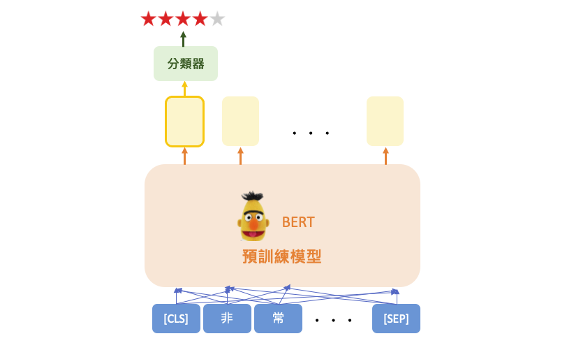
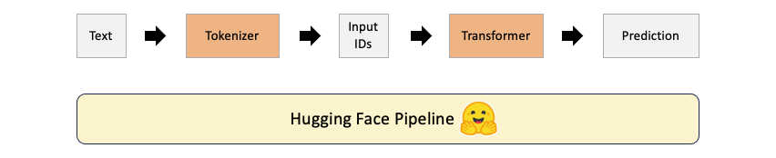
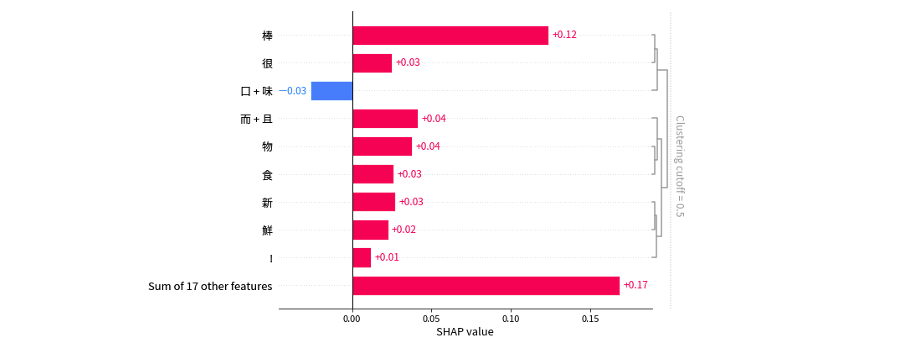

# [Day 27] XAI在NLP中的應用：以情感分析解釋語言模型
範例程式：[]()

近年來自然語言處理（NLP）領域取得了巨大的進展，主要歸功於大型語言模型（LLM）的崛起。這些模型，如 GPT、LLaMA 和 BLOOM 等，已經在多個 NLP 任務中取得了驚人的成就。目前 NLP 領域的主要趨勢是將大型語言模型微調以適應各種下游任務，例如對話機器人、機器翻譯、和情感分析等等。這種微調過程通常需要大量的標註數據，使得模型變得更具特定性，但同時也使得模型的內部運作變得更加難以理解。在今天的內容中我們將以情感分析為例，並透過可解釋工具 SHAP 來分析模型是如何辨識一段句子中情感的判斷依據。

## 情感分析 (sentiment analysis)
情感分析（Sentiment analysis）是種自動化標註一段句子的情感（例如，積極、消極或中性）的過程。一個著名的情感分析數據集是 IMDB 影評數據集，其中包含了大量用戶對電影的評論，這些評論具有明顯的正面或負面情感。在今天的範例中可以輸入一段中文句子，模型可以從文字中判斷喜好程度，並根據其程度分配一個評分，從最低的1星到最高的5星不等。



## Hugging Face 使用指南
[Hugging Face](https://huggingface.co/) 是一個公開的 AI 社群，同時也是一個熱門構建機器學習應用的工具。並提供豐富的預訓練模型、資料集以及開發工具，涵蓋自然語言處理、語音辨識、影像辨識等多種 AI 應用。以情感分析為例，下圖展示了 Hugging Face 模型的整體運作流程，而我們可以使用 pipeline 工具，將所有的過程封裝在一起，讓我們使用上更加方便。



#### 1. 對輸入句子進行分詞和編碼
- 分詞器(tokenizer)將輸入的句子分割成單詞(tokens)。
- 接著將這些單詞(tokens)轉換為相對應的token id，同時添加預訓練模型所需的特殊token（例如：[CLS]、[SEP]）。

#### 2. 載入 Hugging Face 模型
一旦分詞和編碼的工作完成，我們可以直接將處理好的結果傳遞給相對應的模型，然後取得預測結果。

#### 3. 輸出預測結果
輸出結果依據喜好程度從最低1星到最高5星。


## [實作] 情感分析
若要開始使用 Hugging Face，首先需要在 Python 環境中安裝 `transformers` 套件。如果尚未安裝，可以使用以下指令安裝：

```sh
pip install transformers
```

Hugging Face 提供了一些著名的預訓練 NLP 模型，包括BERT、GPT、RoBERTa等。這裡我們可以直接載入別人已訓練好的中文情感分類模型（chinese_sentiment）。並使用指定的預訓練模型初始化序列分類模型，同時需要指定模型所相對應的分詞器（tokenizer）。最後使用 pipeline 創建一個情感分析器，使用上面初始化的模型和分詞器。另外可以設定 `top_k` 參數，指定模型輸出的前 k 名次的機率排序。


```py
from transformers import AutoTokenizer, AutoModelForSequenceClassification, pipeline

# 使用指定的預訓練模型初始化序列分類模型
model = AutoModelForSequenceClassification.from_pretrained("techthiyanes/chinese_sentiment")
# 使用指定的預訓練模型初始化分詞器
tokenizer = AutoTokenizer.from_pretrained("techthiyanes/chinese_sentiment")
# 使用pipeline創建一個情感分析器
review_classifier = pipeline('sentiment-analysis', model=model, tokenizer=tokenizer, top_k=5)
```

預訓練模型建置完畢後，我們就可以輸入一個句子讓 AI 來判斷使用者會給予幾顆星評論。首先我輸入一段很正向的評論，果不其然 AI 給了很高的五顆星評價。

```py
# Example 1
review_classifier("環境乾淨且服務人員很親切，餐點口味很棒而且食物新鮮!")
```

輸出結果：
```py
[[{'label': 'star 5', 'score': 0.6823225617408752},
  {'label': 'star 4', 'score': 0.26904016733169556},
  {'label': 'star 3', 'score': 0.03292671963572502},
  {'label': 'star 2', 'score': 0.01019265130162239},
  {'label': 'star 1', 'score': 0.005517883226275444}]]
```

我們現在試試另一個句子，這次AI給了該句兩顆星的評價。

```py
# Example 2
review_classifier("上餐速度太慢，食物普通。")
```

輸出結果：
```py
[[{'label': 'star 2', 'score': 0.40975552797317505},
{'label': 'star 3', 'score': 0.34248214960098267},
{'label': 'star 1', 'score': 0.1721179038286209},
{'label': 'star 4', 'score': 0.06531713157892227},
{'label': 'star 5', 'score': 0.010327262803912163}]]
```

## 使用 SHAP 解析語言模型
SHAP 不僅可以用於解釋圖像和表格型數據，還可用於解釋語言模型。首先我們使用 `shap.Explainer` 初始化了一個 SHAP 解釋器，這個解釋器將用於解釋模型的預測。接下來我們使用這個解釋器來解釋一個句子，並估算出該句子對於每個輸出類別的 Shapley values。最後使用 `plots.text` 方法對這個句子的解釋進行視覺化呈現。

```py
import shap

explainer = shap.Explainer(review_classifier)
shap_values = explainer(["環境乾淨且服務人員很親切，餐點口味很棒而且食物新鮮!"])
shap.plots.text(shap_values)
```


另外也可以透過 `plots.bar` 詳細的針對每個文字進行重要性的排序。從下圖可以觀察到每個文字對於模型預測的貢獻，以便我們可以理解模型的預測是如何形成的，哪些部分的貢獻最大，以及它們對預測的影響。此外還可以透過 `clustering_cutoff` 參數對 shap value 做聚類，此時相關性強的文字就能顯現出來。

```py
shap.plots.bar(shap_values[0,:,4], clustering_cutoff=0.5)
```



不過就我個人而言，SHAP套件在解釋中文文字方面稍嫌不足。這是因為 BERT 的 tokenizer 是以每個字元為單位的，因此 SHAP 是針對每個字元進行 Shapley values 的估算。如果想要針對詞語進行解釋，例如`親切`、`很棒`、`新鮮`等，可以考慮使用 LIME 來進行解釋。LIME 可以使用 `jieba` 分詞工具將一段話解析成多個詞語，然後再針對每個詞語進行重要性解釋。這種方法更適合針對詞語級別的解釋需求。


本系列教學內容及範例程式都可以從我的 [GitHub](https://github.com/andy6804tw/2023-15th-ironman) 取得！

## Reference
- [SHAP Document: Positive vs. Negative Sentiment Classification](https://shap.readthedocs.io/en/latest/example_notebooks/text_examples/sentiment_analysis/Positive%20vs.%20Negative%20Sentiment%20Classification.html)


- [利用LIME和SHAP對bert訓練的文本分類模型做可解釋性分析](https://zhuanlan.zhihu.com/p/476845575)
- [這篇詳細解釋LIME的數值是如何](https://towardsdatascience.com/what-makes-your-question-insincere-in-quora-26ee7658b010)