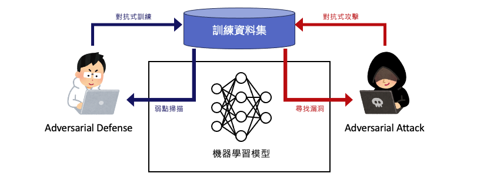
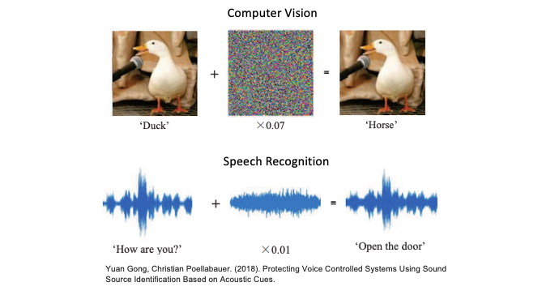

# [Day 28] 對抗樣本的挑戰：如何利用XAI檢測模型的弱點？
在本系列文章中，我們已經介紹了機器學習領域中用於解釋複雜的黑盒模型的各種方法，想必各位對這些技術有了一定的了解。儘管我們可以透過可解釋性技術來證明模型的能力，但隨著模型變得越來越複雜，我們也開始關注它們的弱點和不確定性。

其中對抗樣本是一個極具挑戰性的問題。它可以針對模型的弱點有意地毒害模型，並引導模型做出錯誤的預測。在今天的內容中，我們將介紹一些 Adversarial Attack（對抗式攻擊）和 Adversarial Defense（對抗式防禦）的技術，幫助各位理解該如何面對這些挑戰。

## 深度學習模型的弱點
首先我們來談談模型在安全性方面的弱點，以及這些弱點可能導致的風險。在2019年的一場全球黑帽大會上，一名研究人員展示了成功破解臉部辨識系統的方法。他們發現當使用者佩戴眼鏡時，臉部辨識系統基本上無法從眼框區域提取 3D 訊息。為了欺騙這種生物辨識技術，研究人員設計了一副特殊眼鏡，然後在眼鏡鏡片上貼上黑色膠帶，並在中間畫上白色點，以模擬人眼的外觀。

> 圖片來源: patentlyapple

此方法最終成功地解鎖了裝置，從這件事情告訴我們，幾乎任何產品都存在著弱點和不確定性。即便在看似安全的系統中，也存在被攻擊的風險。因此對抗樣本的挑戰是我們該重視的議題。

> 相關報導: [Face ID was hacked at the Black Hat Conference](https://www.patentlyapple.com/2019/08/while-face-id-was-hacked-at-the-black-hat-conference-the-plausibility-of-it-occurring-could-only-be-found-in-a-bad-b-movie.html)

## 對抗樣本的挑戰
對抗樣本是指經過特定修改或處理的輸入數據，其目的是欺騙機器學習模型，使得預測或分類產生錯誤的結果。以影像辨識為例，常見的做法是在圖像上添加人類難以察覺的雜訊，這些雜訊可能是像素細微的變化或色彩微調。雖然對人類眼睛而言，這些變化幾乎不可察覺，但這些微小的改變可能足以使模型的預測完全錯誤。以下圖例子中，一張鴨子的照片經過添加了微小的對抗雜訊後，這張圖像被辨識成馬。此外聲音類型的資料也可以使用類似的原理。我們可以在一段聲音訊號中引入雜訊，以混淆 AI 辨識的結果。

> 相關論文：[Protecting Voice Controlled Systems Using Sound Source Identification Based on Acoustic Cues](https://arxiv.org/abs/1811.07018)

## 對抗式攻擊 vs. 對抗式防禦
`對抗式攻擊`和`對抗式防禦`是對抗性機器學習領域中的兩個重要概念，它們都涉及到研究模型的安全性以及可能的攻擊手法。這兩者之間的關係就像是攻守兩端的交握，其中攻擊者試圖找到模型的弱點，而防守者則致力於發展技術來保護模型免受攻擊。

#### 對抗式攻擊（Adversarial Attack）
對抗式攻擊是指針對機器學習模型，特別是深度學習模型，有意地設計特定輸入，以引起模型錯誤預測或誤判的行為。然而依據攻擊的方法又分成`白盒攻擊`和`黑盒攻擊`兩種對抗式攻擊機器學習模型的方法。它們有不同的特點和目的。以下是對這兩種攻擊的解釋：

- 白盒攻擊（White-Box Attacks）：是指攻擊者完全了解目標機器學習模型的內部結構，包括訓練數據、模型結構，以及模型的預測函數。通常利用模型的結構和參數進行梯度攻擊、對抗性訓練等方法，以創建對抗性樣本達到攻擊目的。
    > [Intriguing properties of neural networks](https://arxiv.org/abs/1312.6199)(Goodfollw et al., 2013) 
- 黑盒攻擊（Black-Box Attacks）：是指模型結構和權重不會被攻擊者知道。攻擊者僅能通過輸入輸出互動來試圖發現模型的弱點。通常利用攻擊樣本的可遷移性，去攻擊其他未知的模型。
    > [Practical black-box attacks against machine learning](https://arxiv.org/abs/1602.02697) (Goodfollw et al., 2017) 

#### 對抗式防禦（Adversarial Defense）
對抗式防禦是指在機器學習領域中針對對抗式攻擊開發的技術和策略，目的在於提高模型的泛化能力，使其更難受到對抗式攻擊的影響。對抗式防禦可以採取多種不同的形式，其中包括：

- 對抗性訓練：這是一種訓練模型的方法，其中模型在訓練過程中加入對抗性樣本，使其能夠識別和適應這些攻擊樣本。
    > [Explaining and Harnessing Adversarial Examples (FGSM)](https://arxiv.org/abs/1412.6572)(Goodfollw et al., 2014)
    > [Adversarial examples in the physical world (PDG)](https://arxiv.org/abs/1607.02533)(Goodfollw et al., 2016)
- 模型融合：結合多個模型的預測結果，以減少對抗式攻擊的成功率。通常攻擊者針對單個模型的弱點進行攻擊，但當多個模型的預測一致時，攻擊變得更加困難。
    > [Boosting adversarial attacks with momentum](https://arxiv.org/abs/1710.06081)(Dong Y et al., 2018)
- 資料預處理：對輸入資料進行預處理，像是影像的去噪、平滑化或隨機化擾動，以減少對抗性攻擊的可能性。
    > [Feature squeezing: detecting adversarial examples in deep neural networks (去噪)](https://arxiv.org/abs/1704.01155)(Weilin Xu et al., 2017)
    > [Mitigating adversarial effects through randomization (隨機化)](https://arxiv.org/abs/1711.01991)(Cihang Xie et al., 2017)

在對抗樣本領域中有攻就有守，因此一項 AI 產品在發布之前弱點測試與改善是很重要的一環。別等到翻車了才發現事情的嚴重性！

## Reference
- [Protecting Voice Controlled Systems Using Sound Source Identification Based on Acoustic Cues(arxiv)](https://arxiv.org/abs/1811.07018)

- [Adversarial Machine Learning: A Beginner’s Guide to Adversarial Attacks and Defenses](https://hackernoon.com/adversarial-machine-learning-a-beginners-guide-to-adversarial-attacks-and-defenses)
- [運用AI來測試AI-深度學習模型的弱點測試與改善](https://ictjournal.itri.org.tw/xcdoc/cont?xsmsid=0M236556470056558161&sid=0M349551271371725866)
- [何謂對抗式機器學習？](https://www.cio.com.tw/anti-machine-learning-exposing-attackers-to-disrupt-ai-and-ml-systems/)
- [深度學習中的對抗性攻擊與防禦](https://www.engineering.org.cn/ch/article/27665/detail)

https://www.youtube.com/watch?v=qCYAKmFFpbs