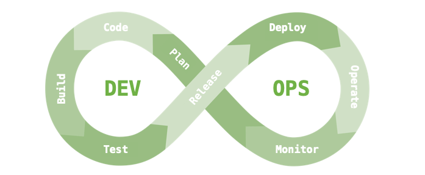
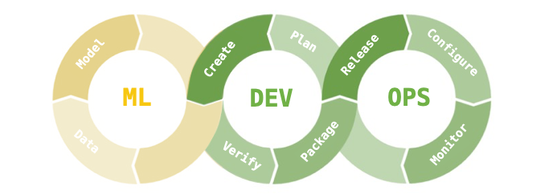
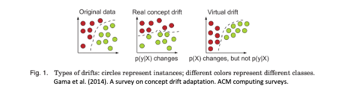

# [Day30] XAI未來發展方向：向更可靠的機器學習模型邁進
機器就像人類一樣，並非百分之百地完美。就如同人類有時會犯錯，機器在預測或決策中也可能犯錯。當我們面對預測錯誤時，如果能夠透過 XAI 分析出合理的原因，可以改善模型並提供有利的根據修正它。在本系列三十天文章中，前半段是針對一般機器學習模型進行可解釋的介紹。在這過程中我們講述了`模型事後解釋`與`模型本身可以解釋`的觀念，並介紹了兩個熱門的 XAI 套件 LIME 與 SHAP。

> [[Day 2] 從黑盒到透明化：XAI技術的發展之路](https://ithelp.ithome.com.tw/articles/10318532)

> [[Day 4] LIME vs. SHAP：哪種XAI解釋方法更適合你？](https://ithelp.ithome.com.tw/articles/10320360)

在本系列後半段從 Day 16 開始講解了深度學習中的可解釋技術，其中帶各位看了 DNN、CNN、LSTM 如何透過一些梯度訊息或是擾動等方法解釋神經網路。

> [[Day 16] 神經網路的可解釋性：如何理解深度學習中的黑箱模型？](https://ithelp.ithome.com.tw/articles/10330576)

如果對電腦視覺的可解釋性有興趣的朋友可以參考 Day18~23，在這幾天文章中詳細介紹幾種不同方法來解析卷積神經網路。另外對於實務應用有興趣的可以參考 Day24~27 文章，在這之中講解了真實生活中的[時間序列資料分析](https://ithelp.ithome.com.tw/articles/10335915)、[影像瑕疵檢測](https://ithelp.ithome.com.tw/articles/10336357)、[鋼材缺陷分類](https://ithelp.ithome.com.tw/articles/10337150)和[自然語言應用](https://ithelp.ithome.com.tw/articles/10337606)，並教導各位如何將這些訓練好的模型進行根因解釋。

<!-- ## 2023年AI發生了什麼大事
1. AI平民化
2. AI技術結合大型語言模型(LLM)
3. 生成式人工智慧(AIGC)應用百花齊放
4. Multimodal(多模態)AI處理能力是未來趨勢
5. MLOps是公司導入AI的重要關鍵
6. 道德AI以及與數據隱私 -->

## XAI的下一步？
首先恭喜各位耐心的看到最後，相信各位已吸收滿滿的乾貨。看到這邊你可能會思考當模型訓練完了，也透過 XAI 確認模型的預測能力後，下一步該怎麼做呢？我們都知道開發的最後一哩路是部署應用。如何將 AI 模型部屬上線，是一個很重要的工程。你問我，我可能會說 MLOps 是企業導入 AI 的重要關鍵!

在介紹 MLOps 前先來談談一個很相近的名詞，叫做 DevOps。以下透過例子解釋 DevOps 的核心流程。當今天有新的功能計畫(Plan)出來時，團隊就會開始著手寫程式(Code)，程式寫完後會進行編譯(Build)打包成一個可執行的應用。接著我們會進行系統的測試(Test)，測試完成後我們會發布第一版(Release)以及部署應用(Deploy)。最後就是維運(Operate)，接下來維護團隊會來觀察(Monitor)這個新功能在客戶端的使用狀況。如果發生問題就會開始計畫更新，或是使用者提出一個新的 issue，團隊經過討論後覺得可行就會進入下個階段著手計畫新的功能。DevOps 的迭代週期非常的快速，其優點是可以不斷的週期性更新功能越來越貼近使用者。這就是所謂的 DevOps 軟體開發流程。

> 延伸閱讀：[上雲、IT現代化需求強，帶動企業2023持續加碼DevOps](https://www.ithome.com.tw/article/159147?fbclid=IwAR38H90Nb7OKCYFp-PBVTLViqMZTnfCose5-h8MxzJzc2SzDGCQpKAcRE68)

我們再回來看看 MLOps，它就是 Machine Learning + DEV + OPS 三個部分的縮寫合併。就如字面上的意思，它更深入地融合機器學習到 DevOps 流程中，並加強模型的維運，同時建立監控系統，以定期檢查模型的適用性並捕捉異常。

接下來討論一個 MLOps 重要環節：
#### Monitoring system(監控系統)
在軟體工程中，我們可以透過建立監控系統，在客戶發現問題之前就已經掌握問題所在。當模型犯錯時，我們會想知道為什麼模型犯錯。但是為什麼模型會犯錯呢？這可能有以下原因：

- 資料看過但學錯
- 資料尚未看過

首先`資料看過但學錯`這問題好解決，我們可以透過 XAI 技術協助我們除錯。例如在影像部分可以使用 Grad-CAM 來判斷模型所專注的區域。表格型的資料可採用 SHAP 來判斷是哪一個特徵造成最後的結果判別以及特徵重要程度。

但是`資料尚未看過`這個問題誰也無法預測。會發生這問題的原因可能是資料蒐集不夠豐富，使得模型學習能力不足。又或因為資料的時變特性造成資料的分佈集逐漸偏移，在學術界我們將這種情況稱為`概念飄移`(Concept Drift)。為了提高模型的預測能力，我們可以建立監控機制適當的檢測模型的適用性。並透過 XAI 的根因分析來查看模型是不是與我們預期的結果一致。

> 在未來，XAI 的技術仍持續發展，相信將會帶來更多的驚喜和創新。

!!! info "延伸閱讀"

    概念飄移(Concept Drift) 相關作法可以參考：

    - [Frouros: an open-source Python library for drift detection in machine learning systems](https://github.com/IFCA-Advanced-Computing/frouros)
    - [Algorithms for outlier, adversarial and drift detection](https://github.com/SeldonIO/alibi-detect)

## Reference
- [machine learning pipeline](https://engineering.linecorp.com/zh-hant/blog/data-dev-interview-1)

- [資料突然無法準確預測？淺談資料飄移](https://blog.infuseai.io/data-drift-ks-test-b884d50e4e12)

- [複雜AI模型下的可解釋性](https://xueqiu.com/9217191040/200505095)
