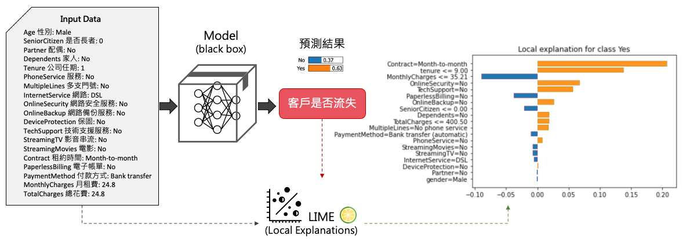
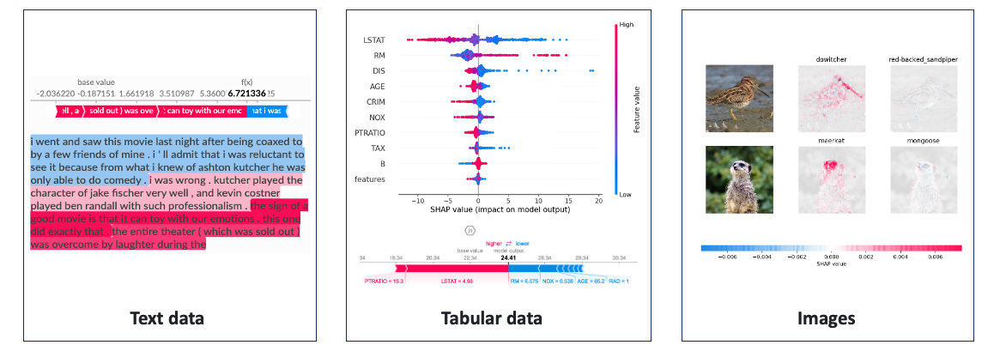
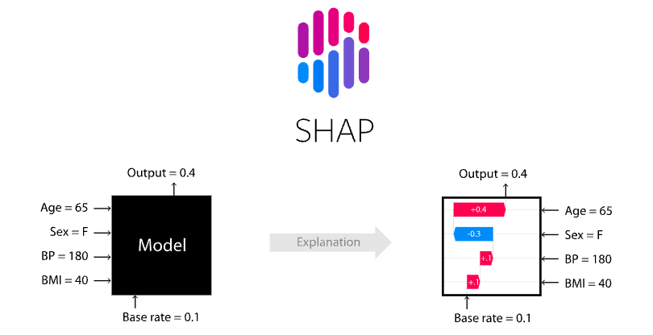

# [Day 4] LIME vs. SHAP：哪種XAI解釋方法更適合你？
LIME 和 SHAP 都是機器學習中的解釋性方法，它們的共同點是都適用於模型無關性（Model Agnostic），並透過資料來解釋模型的預測結果。如果不想深入模型內部，但又想要能解釋模型，那看這篇文章就對了！簡單來說今天介紹的解釋方法不探究模型內部的運作原理，而是嘗試帶一些資料，去觀察輸出結果。然而 LIME 與 SHAP 在解釋方式和範圍上有一些區別。在今天的文章中，我們不會深入探究這兩個方法的背後詳細原理。而是透過一個簡單地例子，讓各位讀者知道兩種方法的差別與使用時機。

## LIME
LIME（Local Interpretable Model-agnostic Explanations）主要提供局部解釋，它透過建立簡單的線性模型來解釋某一筆要被預測的資料。並提供了一個局部近似模型，用於解釋該特定資料的模型預測。它的優點是可以提供針對某一筆特定資料的解釋，並且可以對文字、表格資料、影像進行解釋，但缺點是解釋範圍有限，僅限於觀察局部趨勢。

### LIME 的局部解釋過程
以表格型資料為例，首先我們使用訓練集來訓練一個複雜模型，接著將訓練集和欲解釋的一筆資料輸入到 LIME 中。這時 LIME 機制就會啟動，並從訓練集中隨機採樣N筆資料，每筆資料的預測結果 ŷ 是通過已訓練好的複雜模型計算而得。此外被採樣的N筆資料將與要解釋的那筆資料進行距離計算。距離越近的資料點將獲得更高的權重，因為 LIME 著重於解釋目標附近的資料點。這樣可以確保解釋模型更關注於與要解釋的資料點相似的區域，從而提高解釋的準確性和可解釋性。基於這些權重，LIME 建立一個簡單的線性模型或其他可解釋的模型，用於解釋黑盒模型在該資料點上的預測結果。

LIME 的核心概念就是將「局部的新資料」引入，加上「可理解的擾動」，然後使用這些資料來解釋模型的輸出。以下是 LIME 的解釋過程:
1. 使用訓練集訓練一個複雜模型(black box)
2. 將訓練集與要被解釋的一筆資料餵入LIME
	- 針對訓練集隨機採樣 N 筆數據
	- 採樣的每一筆訓練資料的 y 並非真實答案，而是透過複雜模型預測的結果 ŷ
	- 被採樣 N 筆資料將與要被解釋的那筆資料計算距離，越近的權重越大
	- 將採樣的資料訓練一個簡單模型(線性迴歸)
3. 透過簡單模型來解釋該筆預測結果

透過以上的過程，LIME 能夠生成一個局部解釋模型，用於解釋特定資料點的預測結果。不過 LIME 存在一個缺點，即每當要解釋新的資料點時，需要重新執行上述動作以生成一個新的簡單模型並進行解釋，這可能會帶來一些計算和時間上的成本。這是因為 LIME 是一種局部解釋方法，它專注於解釋單個資料點的預測結果，而不是全局模型的整體解釋。另外如果輸入和輸出之間存在複雜的交互關係，又或是對於特徵的了解度不夠，那麼透過資料解釋的方法可能不適用。

### LIME 應用例 (表格資料)
下面這張圖是一個預測電信客戶流失的例子，該資料集包含了19個特徵。假設有一筆新的客戶資料進來，我們可以透過已訓練好的黑盒模型預測該客戶可能即將流失。至於它是怎被預測出來有 63% 的信心是 Yes(即將流失的用戶) 呢？透過 LIME，我們建立了一個線性模型，以解釋一筆預測結果為63％選擇"是"的資料。從下圖中我們可以觀察到橘色的柱狀圖表示某些特徵對於客戶流失的影響呈正相關，這些特徵可以被視為影響流失決策的關鍵因素。我們特別注意到，「租約時間」這一特徵對於是否續約是一個主要的影響因素，以月為單位續約的客戶可能只是短期的使用者，隨時可能解約。另一方面，藍色的柱狀圖表示其它幾個特徵是影響客戶繼續使用該服務的關鍵因素。

LIME 具有靈活性和易解釋性的優點，可以在解釋黑盒模型時提供局部解釋，使得模型的預測結果更容易理解。但它仍面臨一些問題，如鄰域的定義問題和採樣方法的選擇。此外忽略特徵之間的相關性可能會導致解釋結果的不合理性。因此透過 LIME 解釋模型時需要了解這些限制，並注意其解釋的範圍和可靠性。

## SHAP
相較之下，SHAP（SHapley Additive exPlanations）主要以全局解釋為主，同時也支援局部解釋。它利用 Shapley Value 的概念來計算特徵對於模型預測的貢獻值，並用這些貢獻值來解釋模型的推論過程。SHAP 不僅提供了更全面的解釋，可以理解整個模型的決策方式和特徵重要性。它的優點是能夠提供全局視角的解釋，有助於理解模型的整體行為，但缺點是計算成本較高，特別是在大型資料集和複雜模型上。此方法也可以應用於不同的數據類型，包括文字、表格資料和影像。

[SHAP](https://github.com/slundberg/shap) 套件提供了多種計算 Shapley Value 的方法：

1. TreeExplainer
	- TreeExplainer 是專為解釋樹狀結構的模型（例如決策樹、隨機森林和梯度提升樹）設計。它利用樹狀結構的特性，透過計算每個特徵的 Shapley Value 來解釋模型的預測。
2. DeepExplainer
	- DeepExplainer 是 SHAP 庫中針對深度學習模型的解釋器。並基於 DeepLIFT 利用深度學習模型的反向傳播算法，計算每個特徵對於預測的貢獻，並生成相應的 Shapley Value。
3. GradientExplainer
	- GradientExplainer 是基於模型的梯度訊息進行解釋。它使用模型的預測機率值與該特徵的梯度值之間的乘積作為該特徵的重要性得分。
4. LinearExplainer
	- LinearExplainer 是一種用於解釋線性模型的方法。它適用於線性迴歸、線性分類等簡單的線性模型。
5. KernelExplainer
	- KernelExplainer 是 SHAP 庫中的一種通用解釋器，可以應用於各種模型。它利用核函數對特徵空間進行采樣，並計算每個特徵對於預測的影響力。

### SHAP 的全局/局部解釋過程
SHAP 的全局解釋幫助我們了解模型整體的行為和特徵的重要性，而局部解釋則幫助我們理解模型在特定實例上的預測。以下為 SHAP 的解釋過程:

1. 使用訓練集訓練一個複雜模型(black box)
2. 根據模型演算法特性選擇合適的 SHAP Explainer
3. 將訓練集與要被解釋的資料(可多筆)餵入 Explainer 並計算 SHAP values
- 全局解釋過程：
	- 產生摘要圖表(Summary Plot)，顯示每個特徵的 SHAP value 絕對值加總平均。
- 局部解釋：
	- 單筆資料解釋：根據一筆資料，SHAP 計算每個特徵對該預測的影響。幫助理解為什麼模型對於特定一筆資料做出了特定的預測。

### SHAP 應用例 (表格資料)
我們一樣拿表格資料進行解釋，並與 LIME 進行比較。這裡採用 Kernel SHAP 的方法來估計 Shapley Value。假設有輸入四個特徵，年齡、性別、血壓、BMI作為輸入要預測一個人罹癌的機率。SHAP 要做的是分別計算根據 Age=65 對於輸出0.4有多少貢獻，對於 Sex=F 對於輸出0.4有多少貢獻…。因此會有個基準點 base rate 這裡為0.1，表示都不做任何事就會有輸出0.1機率會罹癌。當看到一個年齡特徵等於65就會加0.4，看到性別等於F就會減0.3，直到累加完所有特徵就是預測總輸出y=0.4。因此 SHAP 模型不管模型演算法做了什麼事，它只管輸入的特徵值對於輸出的結果就可以計算 base rate 是多少，以及每一個特徵值是多少對於最終輸出影響有多少。

Kernel SHAP 的優勢之一是它可以應對高維度的特徵空間，並且計算效率較高，但仍然需要進行大量的計算。因此在應用時需要注意計算效率、核函數選擇、樣本數量和鄰域定義等方面的考慮。適當的選擇和調整這些參數和方法可以提高解釋結果的準確性和可靠性。

## 小結
LIME 和 SHAP 都是重要的解釋性演算法，它們在解釋方式和範圍上有所不同。LIME 提供了局部解釋，主要針對特定的某一筆資料；而SHAP主要提供全局解釋，但也支援局部解釋。選擇哪種方法取決於解釋的需求和應用場景。如果想只關注特定資料的解釋，LIME 可能是一個不錯的選擇；如果需要理解整個模型的行為和特徵的影響，則 SHAP 會更適合。

## Reference
- [可解釋方法LIME和SHAP代碼實戰](https://e0hyl.github.io/BLOG-OF-E0/LIMEandSHAP/#shapley-additive-explanationsshap)

