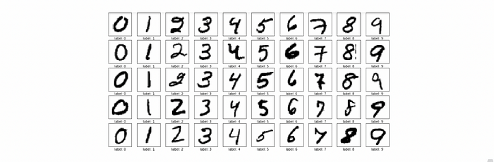
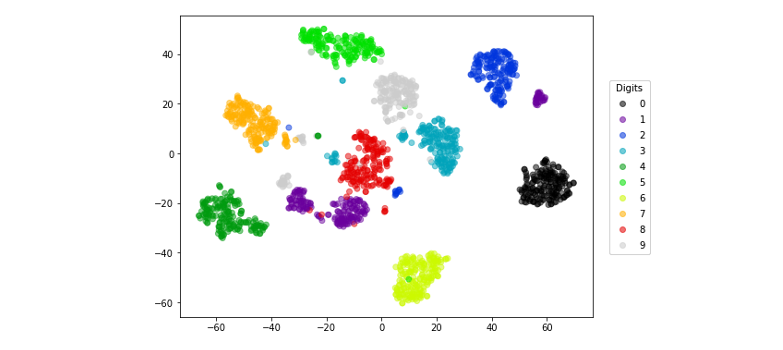
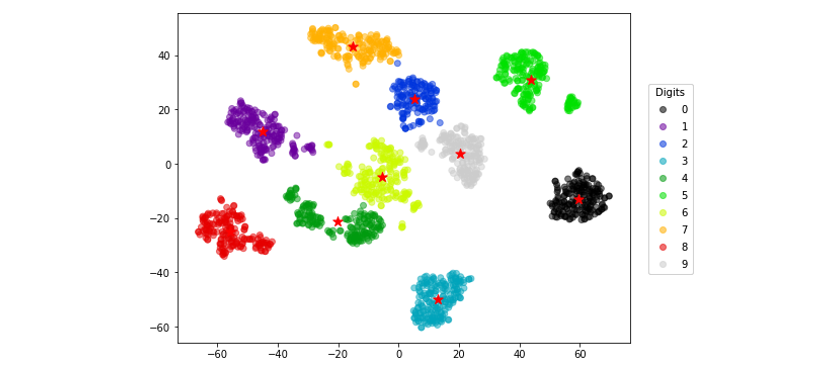

# [Day 6] 非監督學習也能做到可解釋性？探索XAI在非監督學習中的應用

範例程式：[](https://colab.research.google.com/github/andy6804tw/crazyai-xai/blob/main/code/06.非監督學習也能做到可解釋性？探索XAI在非監督學習中的應用.ipynb)

由於非監督學習模型通常沒有像監督學習中的標籤可使用，因此非監督學習模型的可解釋性通常是透過資料視覺化和數據分析來實現。以下為各位整理非監督學習中可解釋性的一些例子：

- 降維分析：將降維後的數據投影回原始空間並視覺化，從中理解原始資料的重要特徵和關係。
  - 主成分分析(PCA)：解釋主成分分析提取的主成分特徵和對原始資料的貢獻，理解資料的降維和結構化過程。
  -  t-隨機鄰近嵌入法(t-SNE)：透過將高維空間中的資料映射到低維空間，並且保留原始資料的局部結構，讓我們能夠視覺化高維資料，從而進行探索性分析。
- 聚類分析：透過解釋聚類結果，探索資料的內在分布和潛在特徵。

## 降維
降維技術是一種數據壓縮技術，可將高維度的數據轉換成低維度表示。透過XAI技術，我們可以對降維後的數據進行解釋，以了解不同特徵對數據降維的影響，以及低維度數據與高維度數據之間的關係。其中主成分分析（PCA）和 t-SNE 等方法都可以進行可解釋性分析。

> 理論知識可以參考全民瘋AI系列2.0[非監督式學習-降維](https://ithelp.ithome.com.tw/articles/10267685)

以下範例使用手寫數字辨識資料集為例，透過可視化方法來顯示 PCA 和 t-SNE 降維的結果。




首先，我們需要從 sklearn 的內建資料集中載入手寫數字資料集。`load_digits()`是一個手寫數字資料集，共有1797筆資料，每筆資料都是8x8的灰階圖片，表示一個0到9的手寫數字。其回傳的資料集包含兩個主要部分：資料和標籤。

```py
from sklearn.datasets import load_digits
from sklearn.model_selection import train_test_split
import numpy as np

# 載入手寫數字資料集
digits = load_digits()
X = digits.data
y = digits.target
```

### 如何使用方差比和方差值優化PCA分析
PCA（Principal Component Analysis）主成分分析是一種常用的線性降維技術，它可以將高維數據映射到低維空間，同時保留數據的主要特徵。在 PCA 中方差比和方差值是用來衡量主成分分析結果。通常我們會選擇方差比較大的主成分，因為它們能夠解釋更多的數據變異性，並保留更多的重要訊息。

- 方差比(variance ratio): 是指每個主成分所解釋的方差佔總方差的比例，用於衡量每個主成分的貢獻程度。
- 方差值(variance): 是每個主成分的方差，代表了每個主成分所包含的訊息量。

我們可以使用 PCA 來降維，並選擇不同的主成分個數，來觀察其對於解釋變異量的貢獻度。

```py
from sklearn.decomposition import PCA

# 將主成分個數設為 1 至 64，計算累積方差比
n_components = range(1, 65)
cumulative_variance_ratio_list = []
variance_ratio_list = []
for n in n_components:
    pca = PCA(n_components=n)
    pca.fit(X)
    variance_ratio_list.append(np.sum(pca.explained_variance_ratio_))
    cumulative_variance_ratio_list.append(np.sum(pca.explained_variance_ratio_))
```

最後我們可以將不同主成分個數下的累積方差比繪製成圖表，來選擇適合的主成分個數。
```py
import matplotlib.pyplot as plt

# 繪製累積方差比圖表
plt.plot(n_components, cumulative_variance_ratio_list, 'ro-', linewidth=2)
plt.xlabel('Number of Components')
plt.ylabel('Cumulative Explained Variance Ratio')
plt.title('Explained Variance Ratio vs. Number of Components')
plt.grid()
plt.show()
```

繪製出來的圖表會顯示不同主成分個數下的累積方差比，我們可以從圖表中找出適合的主成分個數，以達到適當的降維效果。


### 從t-SNE觀察資料降維後的分佈
t-SNE（t-Distributed Stochastic Neighbor Embedding）t-隨機鄰近嵌入法是一種非線性的降維方法，它可以將高維數據映射到低維空間中，同時保留數據的局部結構，因此可以用於探索數據的相似性、聚類和分類等問題。

> 有興趣的讀者可以參考我之前的一篇文章[動手做一個機器學習 API](https://medium.com/ai-academy-taiwan/%E5%8B%95%E6%89%8B%E5%81%9A%E4%B8%80%E5%80%8B%E6%A9%9F%E5%99%A8%E5%AD%B8%E7%BF%92-api-97790e304c23)


我們可以使用 sklearn 中的 TSNE 降維，將原始的高維度資料 X 降維成二維資料 X_embedded。其中 n_components 參數設為 2，代表要將資料降維到二維空間。另外 t-SNE 的結果通常是隨機初始化的，因此 random_state 參數則是設定隨機數生成器的種子，確保每次執行程式時結果一致。

```py
from sklearn.manifold import TSNE

tsneModel = TSNE(n_components=2, random_state=42)
X_embedded = tsneModel.fit_transform(X)
```

最後我們可以將降成兩維的結果透過點散圖繪製出來。t-SNE 可以將相似的點映射到靠近彼此的位置，因此可以很好地顯示數據集中的群集和分類。

```py
plt.figure(figsize=(8,6))
scatter = plt.scatter(X_embedded[:, 0], X_embedded[:, 1], c=y, alpha=0.5,
            cmap=plt.cm.get_cmap('nipy_spectral', 10))
# 加入圖例
legend1 = plt.legend(*scatter.legend_elements(), title="Digits",
                     bbox_to_anchor=(1.03, 0.8), loc='upper left')
plt.gca().add_artist(legend1)
plt.show()
```




## 聚類分析
聚類分析是一種非監督式機器學習技術，用於將相似的觀察值或數據點分為一組，從而形成有意義的子集或群集。

> 理論知識可以參考全民瘋AI系列2.0[非監督式學習 K-means 分群](https://ithelp.ithome.com.tw/articles/10266672)

### k-means 分群
k-means 是聚類分析中最常用的算法之一。它是一種迭代算法，透過反覆計算每個數據點與其所屬群集的重心之間的距離，來不斷更新群集中心點的位置。可使用視覺化方法來顯示每個群集的特徵，例如散點圖或熱力圖，以顯示群集之間的相似性和差異性。接下來我們會拿剛剛手寫數字 t-SNE 降維後的結果，透過分群分類演算法協助我們進行分群。由於我們有十種數字因此我們希望能夠特過分群演算法找出十個中心點。

```py
from sklearn.cluster import KMeans

kmeansModel = KMeans(n_clusters=10, random_state=42)
clusters_pred = kmeansModel.fit_predict(X_embedded)
```

我們可以將 t-SNE 的結果與其他群集算法的結果進行比較，可以確定分類是否與 t-SNE 的分群結果一致。

```py
plt.figure(figsize=(8,6))
plt.scatter(X_embedded[:, 0], X_embedded[:, 1], c=clusters_pred, alpha=0.5,
            cmap=plt.cm.get_cmap('nipy_spectral', 10))

# 加入圖例
legend1 = plt.legend(*scatter.legend_elements(), title="Digits",
                     bbox_to_anchor=(1.03, 0.8), loc='upper left')
plt.gca().add_artist(legend1)
plt.scatter(kmeansModel.cluster_centers_[:, 0], kmeansModel.cluster_centers_[:, 1], s=100, c="r",marker='*')
plt.show()
```



## 小結
今天介紹了三種常見的機器學習技術，並應用在非監督式學習領域。這些方法在資料分析領域中廣泛應用，例如我們可以解釋 PCA 或 t-SNE 轉換後的特徵如何關聯到原始資料，或者解釋 k-means 分群的結果，以理解每個簇中的資料點之間的共同特徵。這些資訊有助於我們更深入地理解資料集中的訊息和趨勢。